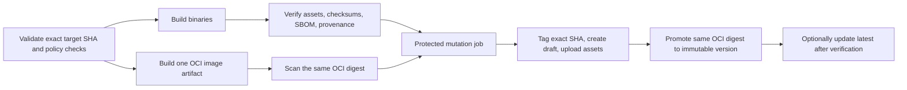

# PR #36 第二轮合并审计报告与整改执行方案

> 审计日期：2026-08-10（Asia/Shanghai）
> 审计对象：[FengYunCalm/Fluffos_XK PR #36](https://github.com/FengYunCalm/Fluffos_XK/pull/36)
> Base：`24bd5f4f5126963966d1d91787f327f4cc84a5e7`
> PR HEAD：`1b664e090c95d402b636908528719f298c1de096`
> 分支：`feat/exec-audit-plan-2026-08-09`
> 当前规模：27 commits、45 files、+8279/-292
> 审计边界：只读审计源码、测试、构建、CI、证据和发布流程；本文件是本轮唯一新增交付物

## 1. 合并结论

**结论：当前 HEAD 不建议合并。**

GitHub 当前显示 `MERGEABLE`，只说明 Git 层面没有冲突；`mergeStateStatus=UNSTABLE`，
且当前 HEAD 的核心 CI、CodeQL 构建和 Docker gate 均未通过。更重要的是，本轮复核确认了
若干自动化测试尚未覆盖的运行时合同缺口，因此“required checks 全绿”只能作为必要条件，
不能单独作为充分条件。

重新审议合并前，至少必须满足：

1. 本报告全部 P0、P1 项关闭，并为当前新 HEAD 提供可重复证据。
2. CI workflow 能被 GitHub 正常解析，所有 job 名唯一，预期矩阵完整执行。
3. 普通构建、CodeQL 构建、Docker gate、ASan/UBSan fuzz 全部通过。
4. Future 的容量、终态、payload 计量和可查询性合同由测试证明。
5. ObjectHandle 的对象目标提交在主线程 admission 或明确 marshal 合同下运行，worker
   不能修改普通对象引用计数。
6. Evidence gate 只消费指定 envelope artifact，严格校验当前提交、时间顺序、清理状态、
   唯一运行标识和 artifact 绑定。
7. Release dry-run 成功，能够证明构建、扫描、校验和最终推广的是同一组 artifact 和同一
   Docker digest；正式写入步骤只在最后的受保护 job 中获得权限。
8. 原审计方案和运行手册按当前证据回写，不再把局部通过或普通模式 smoke 写成 sanitizer、
   跨平台、发布或生产容量完成证据。

T16 的真实 300-player Pair、900 秒长稳态和外部环境容量验证可以继续保持
`external-required`，不要求为本次合并伪造结果；但相关文档必须保持该真实状态。

## 2. 当前证据快照

### 2.1 PR 与远端检查

| 项目 | 当前结果 | 证据 | 判断 |
| --- | --- | --- | --- |
| PR 合并冲突 | `MERGEABLE` | GitHub PR API | 无 Git 冲突，不代表可发布 |
| PR 合并状态 | `UNSTABLE` | GitHub PR API | 存在失败或未闭合门禁 |
| CI | 失败，`jobs=[]` | [run 31378841638](https://github.com/FengYunCalm/Fluffos_XK/actions/runs/31378841638) | workflow 在 job 创建前失效 |
| CodeQL | 失败 | [run 31378845756](https://github.com/FengYunCalm/Fluffos_XK/actions/runs/31378845756) | 普通构建链接 `gateway_fuzz` 时缺少 `main` |
| Docker | 失败 | [run 31378845696](https://github.com/FengYunCalm/Fluffos_XK/actions/runs/31378845696) | smoke 用大小写仓库名匹配已规范化的小写镜像名 |

### 2.2 本地确定性复核

| 复核项 | 结果 | 结论边界 |
| --- | --- | --- |
| PyYAML 解析 `.github/workflows/ci.yml` | `ConstructorError: !matrix.sanitizer` | CI workflow 语法阻断 |
| 普通构建 `gateway_fuzz` | `undefined reference to main` | 默认构建图不成立 |
| 普通 `gateway_fuzz_smoke` | 退出 0，但 `dispatch_runs=0`、`length_rejected=511`、`frames_received=0` | 没有把 reachability/counter 合同变成断言 |
| ASan `gateway_fuzz_smoke` | `gateway_fuzz.cc:166` 后释放 master，`gateway_fuzz.cc:172` 再使用旧指针 | 已确认生命周期缺陷 |
| Future/ObjectHandle 聚焦测试 | 16/16 通过 | 现有测试没有覆盖本报告指出的嵌套 worker admission 和终态保留缺口 |
| `check-docs.py` | 963 个 Markdown 通过 | 仅证明当前文档静态检查 |
| `check-actions-pins.py` | 形式检查通过 | 仅证明 manifest 字符串集合一致，不证明 commit SHA pin |
| `git diff --check` | 通过 | 差异格式无错误 |
| 全量扫描 `build/reports` | 失败，7 份报告产生 19 个错误 | CI 当前下载策略会混入 raw benchmark JSON |
| `cleanup.state=failed` 负例 | 错误地退出 0 | schema 合法不等于 gate 可接受 |
| `ended_at < started_at` 负例 | 错误地退出 0 | 时间顺序未校验 |

### 2.3 证据解释规则

1. 当前源码可达路径、确定性失败和 sanitizer 报告优先级高于提交说明和文档自述。
2. 普通模式未表现异常不能覆盖 ASan 已确认的生命周期缺陷。
3. 单平台 focused tests 通过不能覆盖未测试的线程入口、跨平台矩阵或发布 workflow。
4. schema validation 只回答“格式是否合法”；release gate 还必须回答“这份证据是否来自当前
   目标、清理是否完成、运行是否成功、artifact 是否一致”。
5. PR 的 `pull_request` checkout 可能是合并测试提交。证据模型需要区分 PR source SHA 与
   实际 tested SHA，不能把二者都笼统写成“当前 HEAD”。

## 3. 风险分级

| 级别 | 定义 | 本 PR 的处理要求 |
| --- | --- | --- |
| P0 | 确定性阻断 CI、默认构建或基础验证路径 | 修复后才能进入其他验收 |
| P1 | 运行时正确性、线程/生命周期合同、证据可信度或发布一致性未闭合 | 合并前必须关闭 |
| P2 | 观测语义、严格隔离、权限模型、可复现性或文档状态不完整 | 修复，或明确降级原工作包状态并留下后续门禁 |

## 4. Findings 总表

| ID | 级别 | 发现 | 合并阻断 |
| --- | --- | --- | --- |
| R2-F01 | P0 | CI YAML 无法解析，且 sanitizer job 名不唯一 | 是 |
| R2-F02 | P0 | 默认构建无条件创建无 `main` 的 libFuzzer target | 是 |
| R2-F03 | P0 | Docker smoke 的镜像名匹配和 driver 路径均不正确 | 是 |
| R2-F04 | P0/P1 | fuzz harness 存在 master 生命周期、空输入、资源释放和 reachability 合同缺口 | 是 |
| R2-F05 | P1 | Future terminal slot、失败 tombstone、payload 计量和最老终态指标不满足硬上限合同 | 是 |
| R2-F06 | P1 | ObjectHandle 主线程 admission 只是观测，没有覆盖 worker 内嵌套对象目标提交 | 是 |
| R2-F07 | P1 | Evidence artifact 分流和 gate 裁决不严格 | 是 |
| R2-F08 | P1 | Release DAG、target SHA、权限、tag 顺序和同 digest 推广未闭合 | 是 |
| R2-F09 | P1/P2 | Action、容器镜像和 Dockerfile 下载没有真正消费不可变 pin | 是，发布范围 |
| R2-F10 | P2 | Gateway continuation/scan 指标名称与实际递增事件不一致 | 影响 T13 声明 |
| R2-F11 | P2 | isolated runner 仍是 probe/close/rebind，且 CI 未使用该 runner | 影响 T04 声明 |
| R2-F12 | P1/P2 | `sys_reload_tls()` 边界修复合理，但主线程与调用权限矩阵未建立 | 是，管理操作合同 |
| R2-F13 | P1/P2 | 原方案状态和当前 ASan/CI/指标证据仍不一致 | 是，PR 交付声明 |

## 5. P0 详细问题与整改

### R2-F01：CI workflow 无法解析，sanitizer 检查名不唯一

#### 证据

- `.github/workflows/ci.yml:244` 使用 `if: !matrix.sanitizer`。YAML 将开头的 `!`
  解释为 tag，PyYAML 确定性报错；远端 CI run 没有生成任何 job。
- `.github/workflows/ci.yml:69` 把 ASan、UBSan、TSan 都命名为
  `Ubuntu (clang+sanitizer, Debug)`。多个不同门禁共享同名 context，branch protection 和
  release required-check 逻辑无法精确识别是哪一个 sanitizer 通过。
- 同一 workflow 内的 docs/action-pin 检查无法保护自身语法，因为 workflow 无法解析时这些
  job 根本不会启动。

#### 实施步骤

1. 将所有以逻辑否定开头或包含复杂表达式的 `if` 改成完整 GitHub expression，并加引号或
   使用 `${&#123;&#123; ... &#125;&#125;}` 形式，确保 YAML 解析和 GitHub expression 解析都明确。
2. 给矩阵每一项增加稳定的 `check_name`，job `name` 直接使用该字段。建议至少包括：
   - `Ubuntu GCC Debug`
   - `Ubuntu GCC RelWithDebInfo`
   - `Ubuntu Clang Debug`
   - `Ubuntu Clang RelWithDebInfo`
   - `Ubuntu Clang ASan Debug`
   - `Ubuntu Clang ASan RelWithDebInfo`
   - `Ubuntu Clang UBSan Debug`
   - `Ubuntu Clang TSan Debug`
   - `macOS Debug/RelWithDebInfo`
   - `Windows Debug/RelWithDebInfo`
3. 新增独立、最小的 workflow lint gate，运行固定版本的 `actionlint`；该检查设为 required。
   同时保留 PyYAML 解析，用于发现普通 YAML 错误。
4. 为 workflow lint 增加仓库内测试，断言：
   - 所有 workflow 可解析；
   - 所有 job display name 唯一；
   - 预期 sanitizer 矩阵集合没有缺项；
   - required-check 清单与实际 job 名完全一致。
5. Release 校验不再按空格拆分名称；具体方案见 R2-F08。

#### 完成判据

- `actionlint .github/workflows/*.yml` 通过。
- PyYAML 可读取所有 workflow。
- CI run 生成完整且名称唯一的预期 job 集合。
- 人为删除一个 sanitizer 矩阵项时，仓库测试失败。

### R2-F02：默认构建无条件创建无 `main` 的 fuzz target

#### 证据

`src/tests/CMakeLists.txt:30-41` 无条件创建 `gateway_fuzz`，并始终定义
`GATEWAY_FUZZ_NO_MAIN=1`；只有 `GATEWAY_FUZZ_LIBFUZZER` 开启时才链接 libFuzzer runtime。
普通 `make all`、`make install` 和 CodeQL 构建因此在链接阶段失败。

#### 实施步骤

1. 把 fuzz 共用逻辑与入口分开：
   - `gateway_fuzz_core`：只包含初始化、输入构造和单次执行逻辑；
   - `gateway_fuzz_smoke`：普通 `main`；
   - `gateway_fuzz`：只在 `GATEWAY_FUZZ_LIBFUZZER=ON` 时创建，入口由 libFuzzer 提供。
2. 当 `GATEWAY_FUZZ_LIBFUZZER=ON` 且编译器不是支持 `-fsanitize=fuzzer` 的 Clang 时，
   CMake configure 直接 `FATAL_ERROR`，不要留下晚期链接失败。
3. 默认构建图只包含 `gateway_fuzz_smoke`，不包含 `gateway_fuzz`。
4. 为 CMake 增加 configure/build contract：
   - 默认 GCC/Clang configure + `all/install` 成功；
   - fuzz 开关关闭时目标 `gateway_fuzz` 不存在；
   - fuzz 开关开启时目标存在并链接 libFuzzer；
   - 非支持编译器开启该开关时 configure 明确失败。

#### 完成判据

- 普通 `cmake --build build --target all` 和 `install` 通过。
- CodeQL 构建通过。
- 独立 fuzz build 能运行 `-runs=10000`，不是固定 smoke。

### R2-F03：Docker smoke 同时存在镜像名和可执行路径错误

#### 证据

- `.github/workflows/docker-publish.yml:54` 用保留大小写的
  `FengYunCalm/Fluffos_XK` 搜索 Docker metadata 已生成的小写
  `ghcr.io/fengyuncalm/fluffos_xk:*`。
- `.github/workflows/docker-publish.yml:56` 检查 `/usr/local/bin/driver` 或 `/driver`；
  当前 `Dockerfile` 最终镜像的入口是 `/fluffos/bin/driver`。因此修复大小写后仍会在下一步失败。
- `release.yml` 的手写 `ghcr.io/${&#123;&#123; github.repository &#125;&#125;}` 也保留大小写，正式推广路径存在同类风险。

#### 实施步骤

1. 在 workflow 的单一准备步骤中把仓库名规范化为小写，写入 step output；metadata、smoke、
   scan、push、release notes 全部消费同一个规范化值。
2. Docker PR gate 直接使用 `steps.meta.outputs.tags` 中的明确 tag，不再扫描
   `docker images` 并模糊 `grep`。
3. smoke 检查真实路径 `/fluffos/bin/driver`，并执行一个无外部依赖、可确定退出的命令，
   例如版本或帮助入口；若当前 driver 没有稳定版本入口，则新增专用镜像 healthcheck 命令。
4. 增加测试，断言 Dockerfile `ENTRYPOINT` 与 smoke 检查路径一致。
5. Release 中禁止重新拼接未规范化的镜像引用。

#### 完成判据

- Docker PR gate 构建并运行当前镜像。
- 大小写仓库名输入不会改变最终小写镜像引用。
- smoke 使用的 digest、tag 和 metadata 输出一致。

### R2-F04：fuzz harness 生命周期和边界合同不完整

#### 证据

1. `src/tests/gateway_fuzz.cc:160-166` 构造超大长度帧，该 dispatch 可在
   `gateway.cc:1529` 移除 `GatewayMaster`；随后 `gateway_fuzz.cc:169-174` 继续使用原指针。
   ASan 已在 `gateway.cc:1325` 确认释放后访问。
2. `make_frame_payload()` 在 `size == 0` 时仍通过 `data[0]` 取字节；空 vector 的
   `data()` 不保证可解引用。
3. 每轮 `bufferevent_pair_new()` 创建的 peer 端 `pair[1]` 没有明确释放。
4. libFuzzer 入口在 `init_driver_once()` 失败时直接返回 0，可能形成“运行很多输入但未初始化
   parser”的表面通过。
5. smoke 始终返回 0，没有断言至少一个有效帧被接受、至少一个错误帧被拒绝、资源回到基线。
6. 当前普通输出显示 `dispatch_runs=0`、`frames_received=0`，却仍打印
   `no crash/hang`；该文字不能覆盖 sanitizer 结果。

#### 实施步骤

1. 为每一种场景建立独立的 `FuzzGatewayFixture`：
   - fixture 创建 event base、bufferevent pair 和 master；
   - fixture 析构按所有权规则释放 master 和 peer；
   - dispatch 后不再直接使用可能被移除的 raw master 指针。
2. 测试 API 改为以 fd/handle 重新查找 master，或让 dispatch 返回
   `master_alive`/`removed` 状态；不要让调用方猜测指针生命周期。
3. 空输入使用明确的零字节/固定 seed 路径，不允许在 `size == 0` 时解引用 `data`。
4. libFuzzer 初始化失败必须立即使进程失败；不能返回 0 继续计数。
5. 加入最小有效 corpus：
   - 一个合法生产协议 frame；
   - fragmented 合法 frame；
   - coalesced 合法 frames；
   - oversized、truncated、无效 JSON 和空输入。
6. smoke 将以下条件变成硬断言并在不满足时非零退出：
   - 有效帧成功进入预期处理路径；
   - 非法长度和无效 JSON 各至少被拒绝一次；
   - master/session/event/bufferevent 数量回到基线；
   - 没有残留 deferred callback。
7. 删除无条件的 `no crash/hang` 自述，改为只输出计数；结果由退出码和 sanitizer 决定。
8. ASan 开启 leak detection；UBSan 开启 `halt_on_error`。如项目支持 LSan 独立模式，也加入
   peer 端资源回收测试。

#### 完成判据

- 空输入单测通过。
- 超大长度导致 master 移除后，harness 不再接触旧指针。
- ASan/UBSan bounded fuzz 和 deterministic smoke 均通过。
- leak detection 无 bufferevent peer 残留。
- parser 正向和拒绝路径都有可断言的计数。

## 6. P1 运行时合同整改

### R2-F05：Future 硬上限和终态可查询性合同未成立

#### 证据

- `complete_string_for_task():316-374` 检查 payload byte cap，但不检查 terminal record cap。
- `insert():142-200` 可以直接插入 terminal record，绕过 terminal record 和 payload cap。
- `owner_future_frozen_bytes():12-41` 对 mapping 只计节点结构，不递归统计 key/value；
  string 使用 `strlen`，也没有定义溢出和共享结构的保守计量规则。
- `reject_pending_by_quota_locked():119-139` 把 pending 改成 failed 后立即从 store 删除；
  后续 `poll/state/take` 得到 `unknown`。
- `test_lpc.cc:308-315` 的注释声称“不允许 unknown”，测试却明确跳过 unknown。
- `oldest_terminal_age_ns():442-450` 只读取 payload-free TTL index，payload-bearing terminal
  完全不参与“最老终态”指标。
- `kMaxPendingRecords=65536`、`kMaxTerminalRecords=4096`。如果 pending 没有预留终态槽位，
  大量已接纳任务完成时必然发生无法保留终态的冲突。

#### 目标不变量

1. 一旦 submission 返回成功并分配 future id，该 id 在被 `take`、TTL 合法回收或显式取消前，
   不能因为内部 quota 路径立即变成 `unknown`。
2. pending -> completed/failed 是同一 record 的状态转换，不得在完成时才临时争抢一个未预留
   的终态槽位。
3. payload 超限时，结果 payload 可以拒绝，但必须保留 payload-free failed tombstone 和稳定
   error code。
4. 所有入口共享同一 record/byte accounting；测试或恢复入口不能绕过。
5. 指标名称必须与语义一致：所有终态的最老年龄、可回收终态的最老年龄应分开。

#### 实施步骤

1. 将“terminal slot”改成生命周期 slot：
   - pending admission 时预留未来终态槽位；
   - pending -> terminal 只改变状态和计数，不新增 record slot；
   - tombstone 复用该 slot。
2. 明确容量关系：
   - 如果坚持 terminal 上限 4096，则可同时接纳的、需要可查询终态的 pending 也不能超过
     可用 slot；
   - 如果业务确实需要 65536 pending，则把 total record cap 设计为可容纳该规模，并用内存/
     soak 证据决定数值，不能在 completion 时删除结果维持表面上限。
3. 删除“quota rejected 后 erase”的实现。转换为：
   `state=failed`、稳定 `error`、`terminal_at_ns`、无 payload、可 `poll/take`。
4. 将 `insert` 拆成受限 API：
   - `admit_pending()`：唯一生产 admission；
   - 如确需恢复 terminal record，使用 `restore_terminal_checked()`，完整执行 record/byte cap。
5. 建立单一、可测试的 frozen payload weight visitor：
   - number/real/string/array/mapping 全覆盖；
   - mapping key 和 value 都计量；
   - 使用项目字符串长度 API，不用 `strlen` 低估；
   - 使用饱和加法，超过 cap 立即停止；
   - 定义深度和节点数上限；
   - native `std::string` 按实际保留容量或先复制成紧凑存储。
6. 维护两个时间索引：
   - all-terminal index：用于 `oldest_terminal_age_ns`；
   - reapable-terminal index：只用于 payload-free TTL 回收。
7. Debug invariant 扩展到：
   - total slots；
   - pending/terminal 分类；
   - reserved slots；
   - payload bytes；
   - 两个时间索引；
   - task -> future 索引。
8. 统一所有 completion 入口：frozen、native string、fail、timeout、cancel、executor exception。

#### 必须新增的测试

- terminal cap 边界：cap-1、cap、cap+1。
- pending 数量远大于当前 terminal 数量后批量完成，不出现即时 unknown。
- native string completion 在 cap 满时保留 failed tombstone。
- frozen nested mapping 的 key/value 字节都计入。
- 深度、节点数、超长 string 和饱和溢出。
- quota rejection 后 `poll/state/take` 返回 failed，直到 take/TTL。
- payload-bearing terminal 参与 all-terminal oldest age，但不被 payload-free TTL 回收。
- 所有 completion 入口共享相同计数结果。
- 并发 completion/take/reap 下计数不为负、索引不漂移。

#### 完成判据

- “成功 admission -> 可查询终态”成为自动化不变量。
- record 和 payload 上限无法通过任何 public/test helper 绕过。
- ASan/UBSan/TSan focused tests 通过。
- benchmark 记录 quota visitor 成本和高水位，未引入无界全表扫描。

### R2-F06：ObjectHandle 主线程 admission 未强制

#### 证据

- `vm_object_handle_acquire():1656-1667` 在 worker 上只增加测试计数，仍继续 `add_ref`。
- `submit_owner_message():5162-5315` 注释称“Main-thread admission”，函数本身没有
  main-thread guard。
- `owner_call_async()`、`owner_async()`、`vm_owner_lpc_task()` 等 efun 没有禁止从 owner
  worker 正在执行的 LPC 方法中再次提交对象目标任务。
- `vm_owner_lpc_task()`、ordinary LPC、canary 等路径仍直接 `add_ref(task.target)`。
- 当前 worker-ref 测试从主线程提交任务，只验证 worker 消费预先持有引用；没有覆盖 worker
  内嵌套提交。
- `VMObjectRefGuard::release()` 先 `free_object`，再返回原指针；返回值可能已经不能安全使用，
  API 名称也容易被误解为“转移所有权”。

#### 目标合同

1. 普通 `object_t` 引用计数修改只允许在主 VM 线程发生。
2. worker 只能消费已经持有的引用，并通过 deferred release 交回主线程。
3. 所有对象目标 submission 入口共享同一个 admission policy，不能只修
   `submit_owner_message`。
4. worker 内嵌套对象目标提交必须二选一并固化：
   - 推荐：marshal 到主线程完成 resolve/acquire/register/enqueue；
   - 如果产品不需要该能力：稳定拒绝并返回 `main_thread_admission_required`。

#### 实施步骤

1. 建立 `ObjectTargetAdmission` 统一入口，返回同时包含 status 和 held reference 的结果，
   避免 acquire 后再次 resolve 造成状态描述漂移。
2. 主线程路径：
   - 同一 object-store lock 域内 resolve + epoch/status 校验 + `add_ref`；
   - future 注册和 queue publication 遵循现有事务顺序；
   - 失败时在主线程释放。
3. worker 路径推荐实现：
   - 只构造不可变 handle、frozen payload 和 admission request；
   - 放入 main admission queue；
   - 主线程完成 acquire 和真正提交；
   - admission 自身有可查询 future/状态，失败必须终态化。
4. 如果暂时选择“拒绝”策略，所有对象目标 efun 统一返回同一错误码，文档明确该限制。
5. 给 `vm_object_handle_acquire` 增加 release 构建也生效的主线程防线；不能只靠 Debug assert
   或测试计数。
6. 清点所有 `add_ref(task.target)` submission 路径，为每个函数声明 allowed thread，
   并由代码 guard 强制。
7. 将 `VMObjectRefGuard` API 拆为：
   - `reset()/release_ref()`：释放引用，不返回指针；
   - `detach()`：只转移指针且不释放；
   禁止当前“释放后返回旧指针”的混合语义。

#### 必须新增的测试

- owner worker 的 allowlisted LPC 方法内部调用 `owner_call_async(object, ...)`。
- worker 内调用 `owner_async(object, ...)`。
- worker 内调用 `vm_owner_lpc_task(object, ...)` 和 ordinary LPC submission。
- 每条路径断言 worker ref mutation 为 0。
- marshal 成功、stale handle、目标析构、queue backpressure、future cap rejection。
- deferred release queue 最终归零。
- acquire/destruct/epoch-change 并发测试。
- guard `reset` 与 `detach` 的所有权测试。

#### 完成判据

- 任何对象目标入口都不能在 worker 直接 `add_ref/free_object`。
- 嵌套提交策略有代码、错误码、测试和文档四重证据。
- TSan 无 race 报告，ASan 无生命周期报告。

## 7. P1 证据与发布整改

### R2-F07：Evidence artifact 和 gate 裁决不严格

#### 证据

- `ci.yml:50-65` 下载当前 workflow 的所有 artifact 并 `merge-multiple`，随后递归校验全部
  JSON。`lpc-modern-runtime-bench-smoke` 上传的是 raw benchmark JSON，不符合 evidence
  envelope schema。
- `check-evidence.py` 接受 `cleanup.state=failed/partial/unknown` 作为格式合法结果，却没有
  release-gate policy 将其判为失败。
- 只检查 timestamp 能解析，不检查 `ended_at >= started_at`，也不强制 UTC。
- `owner-scheduler-capacity.sh` 把 cleanup 固定写成 `clean`，没有从 bench 的 queue/future/
  claim/ref 指标推导。
- `run_id` 只由 benchmark 名和 commit 前缀构成；同一 commit 的多次运行重复。
- 本地 capacity envelope 仍绑定旧提交 `71ab40f...`，但状态文档使用了“当前 checkout”
  表述。

#### 实施步骤

1. Artifact 分流：
   - envelope artifact 使用固定名称和固定目录，例如 `capacity-evidence-envelope`；
   - raw benchmark 放入不同 artifact；
   - Evidence Gate 用 `pattern` 精确下载 envelope，不递归扫描所有 JSON。
2. 将“schema validator”和“gate policy”分层：
   - validator：格式、字段、类型、schema；
   - gate：`evidence_kind=current`、`cleanup.state=clean`、运行成功、时间有序、目标 SHA、
     artifact digest、唯一 run id。
3. 时间校验：
   - 必须是带时区的 UTC；
   - `ended_at >= started_at`；
   - 可选限制最大未来偏差；
   - `jsonschema.FormatChecker` 真正启用 format 检查。
4. Commit 身份明确记录：
   - `source_sha`：PR head 或 push source；
   - `tested_sha`：实际 checkout/build SHA；
   - `base_sha`：PR base，可选；
   - gate 从 workflow context 显式传入预期值，不靠模糊文案。
5. `run_id` 使用 GitHub `run_id + run_attempt + matrix key`；本地使用 UUID。批量 gate
   检查 run id 唯一。
6. wrapper 读取每个 benchmark 的 cleanup contract：
   - queue/backlog 为 0；
   - owner claim/release 平衡；
   - deferred refs 为 0；
   - future pending 为 0；
   不满足时写 `failed` 并使 gate 失败。
7. build config hash 改为完整 SHA-256，覆盖编译器、CMakeCache、preset、关键环境和源码目标。
8. 记录 raw report SHA-256，并让 envelope 绑定该 digest。
9. 为 checker 增加独立单元测试，而不是只通过手工运行脚本验证。

#### 负例测试

- 空报告集。
- raw JSON 混入 envelope 目录。
- cleanup 为 failed/partial/unknown。
- 逆序时间、无时区时间、未来时间。
- source/tested SHA 不匹配。
- 重复 run id。
- raw artifact digest 被修改。
- benchmark 命令非零但仍生成 JSON。
- queue/ref/future 未清空。

#### 完成判据

- CI 只校验预期 envelope 集合。
- 任一负例都非零退出。
- 当前新 HEAD 的 envelope、raw digest、workflow run 和 build artifact 可相互追溯。

### R2-F08：Release workflow 不能保证正确目标和同一 artifact 推广

#### 证据

1. `create-release` 和 `finalize-release` 多处使用非直接依赖的
   `needs.validate-target`；GitHub Actions 的 `needs` context 只保证直接依赖。
2. required-check 名称按空格拆分，包含空格的完整 context 会被拆坏；fallback 还漏掉 fuzz、
   Evidence Gate、CodeQL、Docker 和各 sanitizer。
3. `validate-target` 和 `create-release` checkout 没有都锁定 target SHA；
   `create-release` 的 tag 可能落到 workflow 默认 checkout。
4. tag 在下载并复核 checksum、SBOM 前推送。
5. Trivy 同时使用 `continue-on-error` 和 `|| true`，HIGH/CRITICAL 结果不会阻断。
6. `build-docker` 的本地镜像不会跨 runner 保留；`finalize-release` 又重新 build 并 push，
   因此扫描对象与发布对象不是同一 digest。
7. digest output 没有形成可下载的 digest 文件，`docker-digest` artifact 实际只上传 Trivy JSON。
8. 全 workflow 赋予 `contents/packages: write`，构建 job 也持有写权限；创建 tag/release 的
   job 没有受 protected environment 约束。
9. concurrency 按 target SHA 分组，不同 SHA 同日仍可能同时计算并争用同一版本 tag。
10. checksum 文件没有作为 release asset 上传；SBOM 只做 JSON 语法检查，没有在 release
    workflow 中执行 CycloneDX schema、组件完整性和 target SHA 绑定验证。
11. `ghcr.io/${&#123;&#123; github.repository &#125;&#125;}` 保留大小写。

#### 目标 DAG



#### 实施步骤

1. 把复杂 shell 从 YAML 抽到计划新增的 `tools/release/*` 可测试脚本，workflow 只负责编排和权限。
2. `validate-target`：
   - checkout `ref: target_sha`；
   - 验证完整 40 位 SHA；
   - 验证属于 `origin/master`；
   - 验证 checkout HEAD 精确等于 target；
   - 输出 version、target SHA、规范化镜像名。
3. Required checks：
   - 使用 JSON 数组或 GitHub GraphQL status rollup 精确读取完整名称；
   - 检查唯一 job 名；
   - release policy 自己维护完整门禁集合，不把 branch protection 的最小集合当成完整发布集合；
   - 缺失、排队、取消、中性或失败都不能当 success。
4. 所有消费 `needs.validate-target` 的 job 都把它列为直接依赖，或只消费直接上游明确转发的
   outputs。
5. 单次 Docker 构建：
   - `buildx` 输出 OCI archive/layout；
   - 计算并保存 digest；
   - 对该 archive/digest 运行 Trivy；
   - 上传 OCI artifact、digest、scan report；
   - 最终 job 下载同一 OCI artifact，用 `skopeo/crane` 推广，不重新 build。
6. Trivy 使用阻断策略，例如 HIGH/CRITICAL 达阈值时退出非零；报告使用 `if: always()` 上传，
   但扫描结果本身不能被忽略。
7. 新增 `verify-release-inputs` 只读 job，在任何远端写入前完成：
   - binary checksum；
   - checksum 文件完整性；
   - SBOM CycloneDX schema；
   - manifest 与 SBOM 一致；
   - target SHA/provenance；
   - OCI digest 与 scan report 绑定。
8. 只有最后的 `publish-draft`/`promote-image` job 具有：
   - `contents: write`；
   - `packages: write`；
   - protected `release` environment。
   其他 job 仅 `contents: read`，checkout 设置 `persist-credentials: false`。
9. mutation job 使用全局 release concurrency，避免不同 SHA 争用日期版本号。
10. tag 精确指向 `target_sha`，并在所有自动门禁之后创建；随后创建 draft release。
11. Release assets 至少包含：
    - Windows/Linux binaries；
    - 每个 binary 的 checksum；
    - SBOM；
    - dependency manifest；
    - provenance/evidence summary；
    - Docker digest 文件。
12. 推送 immutable version 后，从 registry 重新 inspect，断言远端 digest 等于已扫描 digest；
    `latest` 只引用该 digest。

#### Dry-run 与故障注入

新增默认无写权限的 `dry_run` 模式，完整执行到 mutation 边界。至少验证：

- target SHA 不在 master。
- required check 缺失或失败。
- checksum 被修改。
- SBOM schema 失败或 target SHA 不匹配。
- Trivy 达到阻断阈值。
- OCI artifact digest 被修改。
- 上传 release asset 前失败。
- immutable image 推广后远端 digest 不一致。
- 两个不同 target SHA 同时触发。

#### 完成判据

- Dry-run 完整通过且没有 tag/release/image 写入。
- 受保护环境演练中，最终发布 digest 与扫描 digest 完全一致。
- 任一前置 gate 失败时，mutation job 不启动。
- 构建 job 的 token 无写权限。

### R2-F09：供应链 pin 门禁名实不符

#### 证据

- `check-actions-pins.py` 只比较 workflow 和 manifest 的字符串集合。
- manifest 注释称追踪 commit-SHA pins，实际 entries 全是可变 major tag。
- `Dockerfile` 和 `release.yml` 使用 `alpine:3.18`，manifest 中记录的 digest 没有被消费。
- `Dockerfile` 通过 `wget | tar` 获取 jemalloc，没有校验 manifest 中的 SHA-256。
- Trivy 使用可变 tag `aquasec/trivy:0.50.1`。

#### 实施步骤

1. GitHub Actions 全部 pin 到完整 commit SHA，并在行尾保留可读版本注释。
2. manifest 改为结构化记录：action 名、commit SHA、版本标签、上游链接、review date。
3. checker 强制 `uses` 的 ref 匹配 40 位十六进制 SHA，并校验与 manifest 精确一致。
4. Dockerfile `FROM` 和 release Alpine 容器都消费同一 digest。
5. Trivy 镜像 pin digest，并记录漏洞数据库版本/更新时间。
6. Dockerfile 禁止 pipe-to-tar；先下载文件、校验 SHA-256，再解压。
7. 新增 Dockerfile/workflow image pin checker，保证 manifest digest 不是只写文档。
8. CI 运行 `tools/sbom-generate.py --validate`，release 再对目标 SHA 重新生成和验证。

#### 完成判据

- 任一 action 改回 major tag 时 CI 失败。
- 任一 container tag 未带 digest 时 CI 失败。
- 修改下载内容或 checksum 时构建失败。
- 发布 SBOM 可绑定 target SHA、manifest digest 和 artifact digest。

## 8. P2 与声明一致性整改

### R2-F10：Gateway 指标名称与递增事件不一致

#### 证据

- `master_output_scan_coalesced` 在 continuation callback 实际执行时递增，不是“重复请求被
  合并”的次数。
- `master_output_scan_executed` 累加 `flushed` session 数，不是 scan 或 continuation 执行数。
- `master_output_scan_schedules` 在 `add_walltime_event` 返回前递增，更接近 schedule attempt，
  注释却称成功 schedule。
- `master_output_flush_continuations` 记录“需要 continuation”，不等于成功调度。

#### 实施步骤

1. 先写指标语义表，再改名称或递增点。建议拆为：
   - `scan_runs_total`；
   - `scan_entries_total`；
   - `ready_selected_total`；
   - `ready_remaining_total`；
   - `continuation_needed_total`；
   - `continuation_schedule_attempts_total`；
   - `continuation_scheduled_total`；
   - `continuation_coalesced_requests_total`；
   - `continuation_callbacks_executed_total`；
   - `sessions_flushed_total`。
2. `write_flush_scheduled` 已为 true 而新的请求到达时，才增加 coalesced request。
3. `add_walltime_event` 成功返回后再增加 scheduled；失败单独计数。
4. callback 开始时增加 callbacks executed。
5. 增加可注入 scheduler 测试，覆盖成功、失败、重复请求、callback 执行和预算耗尽。
6. 更新 status map、文档、benchmark parser 和旧指标兼容策略。

#### 完成判据

- 每个计数都能由一个确定事件触发。
- 单测可精确断言一次请求序列对应的所有 delta。
- T13 状态在 1K/4K/16K session 报告产生前保持 `needs-remediation`。

### R2-F11：端口隔离仍是 best-effort，且 CI 未使用 isolated runner

#### 证据

- `run-isolated.sh` 的 flock 只覆盖“选择端口”，不覆盖 probe socket 关闭到 driver bind 的窗口。
- fallback mkdir lock 在异常退出时可能残留。
- `ci.yml:306-307` 仍直接运行 `driver etc/config.test -ftest`，没有使用新 runner。
- 脚本文档已诚实标注“NOT strict isolation”，因此不能把它登记为严格隔离完成。

#### 实施步骤

1. CI 的 LPC Testsuite 改为调用 `tools/testsuite/run-isolated.sh`，并明确 audit/enforced 模式。
2. Driver 支持配置端口 0：
   - `src/base/internal/rc.cc` 接受 0；
   - `src/comm.cc` bind 后用 `getsockname` 回写实际端口；
   - `sys_network_ports()` 和日志暴露实际端口。
3. runner 直接配置 0，不再先 probe 再关闭。
4. fallback lock 记录 owner PID/时间，trap 清理自己持有的 lock，并能安全识别陈旧 lock。
5. 新增 5 次串行、20 个并发进程测试；每个实例断言四个实际端口唯一、仅 loopback、退出后
   无残留进程/目录/lock。
6. `--bind-all` 只用于显式网络测试，不作为默认。

#### 完成判据

- CI 实际消费 isolated runner。
- 端口由 OS 在 bind 时分配，没有 probe/close/rebind 窗口。
- 并发测试零端口冲突、零残留。

### R2-F12：`sys_reload_tls()` 缺少权限和线程矩阵

#### 证据

- `src/packages/core/sys.cc:62-65` 的 1-based 边界检查合理，已避免越界和极值减法问题。
- `src/packages/core/core.spec:381` 只暴露 efun，没有 privileged-caller gate。
- `sys.cc:80` 注释假设“all EFUNs”都在主线程；当前 owner worker 已能执行 allowlisted LPC，
  该全局假设不再可靠。
- 现有测试只覆盖索引/TLS 类型，没有覆盖授权调用者和 worker 调用。

#### 实施步骤

1. 定义管理操作权限 hook，优先复用项目 master-object 权限模式；如果没有现成 hook，
   新增明确的 `valid_sys_reload_tls` 或等价策略。
2. 权限和线程检查顺序固定：
   - 非主线程稳定拒绝，不直接操作 listener/TLS context；
   - 未授权调用者稳定拒绝；
   - 授权后再校验端口索引和 TLS 类型。
3. 不建议把 TLS reload marshal 到 worker/owner 模型；该操作应保持主线程管理边界。
4. 测试矩阵：
   - main + authorized + valid TLS：成功；
   - main + unauthorized：拒绝；
   - worker + authorized identity：仍拒绝；
   - 极值索引：授权 fixture 下验证边界；
   - websocket/non-TLS：稳定拒绝；
   - reload 失败时旧 SSL_CTX 保持有效。
5. 更新 SECURITY.md 和 gateway runbook，说明谁能调用、在哪个线程执行、失败是否原子。

#### 完成判据

- 权限与线程矩阵自动化覆盖。
- worker 无法触碰 TLS listener 状态。
- reload 失败不会先关闭旧 context。

### R2-F13：状态文档与当前证据不一致

#### 需要回写的关键点

1. `docs/codebase-audit-and-execution-plan-2026-08-09.md`：
   - T11 不能再写成 worker ref contract 已闭合；
   - T12 不能再写 terminal cap/bytes 已完整闭合；
   - T13 不能写 counters 语义正确；
   - T15 不能保留“无异常”类 fuzz 结论；
   - 验证总览必须记录当前 ASan fuzz 失败和 CI workflow 无法解析。
2. 第一轮 `docs/pr-36-merge-audit-and-remediation-plan-2026-08-10.md` 是当时 HEAD 的历史快照，
   应增加“已被第二轮报告补充”的链接，不直接覆盖历史证据。
3. Release、capacity、gateway runbooks 与最终实现保持一致。
4. 状态只使用：
   `done`、`needs-remediation`、`blocked`、`external-required`、`unknown`。
5. `done` 必须链接当前 HEAD 的命令、run、artifact 和结果；提交说明不能单独作为完成证据。

#### 完成判据

- 文档 checker 通过。
- 状态表和当前 CI/API/本地证据一致。
- T16 继续保持 `external-required`。

## 9. 分阶段执行路线

### Phase 0：恢复可信基础门禁

| 顺序 | 工作包 | 主要文件 | 完成出口 |
| --- | --- | --- | --- |
| 0.1 | R2-F01 workflow 语法、唯一 job 名、actionlint | `.github/workflows/ci.yml`、workflow lint 脚本/测试 | GitHub 生成完整矩阵 |
| 0.2 | R2-F02 fuzz CMake 目标拆分 | `src/tests/CMakeLists.txt`、fuzz 入口文件 | 默认 all/install 和 CodeQL 构建通过 |
| 0.3 | R2-F03 Docker smoke | `docker-publish.yml`、`Dockerfile`、共享镜像名脚本 | Docker gate 通过 |
| 0.4 | R2-F04 fuzz 生命周期修复 | `gateway_fuzz.cc`、Gateway test API | ASan/UBSan/LSan 通过 |

Phase 0 未完成前，不接受“CI 绿色率”或普通 smoke 作为后续工作包完成证据。

### Phase 1：关闭运行时不变量

| 顺序 | 工作包 | 主要文件 | 完成出口 |
| --- | --- | --- | --- |
| 1.1 | Future slot/tombstone/accounting | `src/vm/internal/owner_future_store.h`、`src/vm/internal/owner_future_store.cc`、`src/vm/internal/owner.cc`、`src/tests/test_lpc.cc` | 所有 Future 不变量测试和 sanitizer 通过 |
| 1.2 | Object admission/marshal | `object_store.cc`、`object_handle.h`、`owner.cc`、`vm_owner.cc` | worker ref mutation 始终为 0 |
| 1.3 | TLS 管理合同 | `sys.cc`、master 权限 hook、LPC fixtures | 权限/线程/失败原子性矩阵通过 |

Future 和 ObjectHandle 各自应使用独立提交；API、调用方、cleanup 和测试必须在同一工作包内
原子交付，避免只修一半。

### Phase 2：证据、供应链和发布

| 顺序 | 工作包 | 完成出口 |
| --- | --- | --- |
| 2.1 | Evidence artifact 分流与严格 gate | 所有正负例通过，当前 SHA artifact 可追溯 |
| 2.2 | Action/container/download pin | checker 能发现可变 tag 和未消费 digest |
| 2.3 | Release DAG 和单 digest 推广 | dry-run 通过，故障不会启动 mutation job |
| 2.4 | 受保护环境演练 | registry digest 与扫描 digest 一致 |

### Phase 3：观测、隔离和文档

| 顺序 | 工作包 | 完成出口 |
| --- | --- | --- |
| 3.1 | Gateway 指标语义 | 事件到 counter delta 的单测通过 |
| 3.2 | Driver 端口 0 与 CI isolated runner | 5 次串行 + 20 并发零冲突 |
| 3.3 | 状态与 runbook 回写 | 文档和当前证据一致 |

### Phase 4：最终验收

1. 当前新 HEAD 运行全部 required checks。
2. 验证 job 集合完整，不允许“workflow 失败但 required check 缺失”被误判。
3. 运行 release dry-run 和无副作用故障注入。
4. 复核 staged diff，只包含本 PR 整改文件。
5. 由独立审计再次检查 Future/ObjectHandle/Release 的实现，而不是只看测试名称。

## 10. 建议验证矩阵

### 10.1 Workflow 与构建

```bash
python3 - <<'PY'
from pathlib import Path
import yaml
for path in sorted(Path(".github/workflows").glob("*.y*ml")):
    yaml.safe_load(path.read_text(encoding="utf-8"))
    print("OK", path)
PY

actionlint .github/workflows/*.yml

cmake -S . -B build-default -DCMAKE_BUILD_TYPE=Debug -DMARCH_NATIVE=OFF
cmake --build build-default --target all -j2
cmake --build build-default --target install -j2
```

### 10.2 Fuzz 与 sanitizer

```bash
cmake -S . -B build-fuzz \
  -DCMAKE_C_COMPILER=clang \
  -DCMAKE_CXX_COMPILER=clang++ \
  -DCMAKE_BUILD_TYPE=Debug \
  -DENABLE_ASAN=ON \
  -DENABLE_UBSAN=ON \
  -DGATEWAY_FUZZ_LIBFUZZER=ON \
  -DENABLE_LTO=OFF \
  -DMARCH_NATIVE=OFF

cmake --build build-fuzz --target gateway_fuzz gateway_fuzz_smoke -j2

ASAN_OPTIONS=detect_leaks=1:halt_on_error=1 \
UBSAN_OPTIONS=halt_on_error=1:print_stacktrace=1 \
./build-fuzz/src/tests/gateway_fuzz_smoke

ASAN_OPTIONS=detect_leaks=1:halt_on_error=1 \
UBSAN_OPTIONS=halt_on_error=1:print_stacktrace=1 \
./build-fuzz/src/tests/gateway_fuzz \
  -runs=10000 -max_len=4096 -timeout=5 -print_final_stats=1
```

### 10.3 Future/ObjectHandle

聚焦测试应按测试 suite 拆分。纯单元测试可以使用 `--gtest_repeat`；依赖
`DriverTest::SetUpTestSuite` 的测试不要在同一进程用 program-level repeat，应以新进程重复，
避免静态 driver 初始化被重复执行。

必须覆盖：

- Future admission/cap/tombstone/payload/time-index。
- worker nested object-target submission。
- acquire/destruct/epoch-change。
- deferred release drain。
- executor exception/timeout/cancel。
- TSan concurrency subset 非空且通过。

### 10.4 Evidence

```bash
python3 tools/docs/check-evidence.py \
  --reports-dir build/reports/evidence-envelope \
  --schema docs/evidence/manifest.schema.json \
  --repo .

python3 tools/sbom-generate.py --validate
```

除正例外，CI 必须自动运行第 7 节列出的全部负例。

### 10.5 Docker 与 Release

1. PR Docker gate：构建、加载、检查 `/fluffos/bin/driver`、运行 health/version smoke。
2. Release dry-run：生成 binaries、checksums、SBOM、OCI archive、digest、Trivy report、
   provenance；不授予 write 权限。
3. 受保护演练：推广 OCI archive，远端 inspect digest 与记录值相同。
4. checksum、SBOM、manifest、digest 文件都出现在 draft release assets。

### 10.6 跨平台

| 平台/配置 | 必须结果 |
| --- | --- |
| Ubuntu GCC Debug/RelWithDebInfo | 全量 CTest + isolated LPC |
| Ubuntu Clang Debug/RelWithDebInfo | 全量 CTest |
| ASan Debug/RelWithDebInfo | 全量适用测试 + fuzz smoke |
| UBSan Debug | 全量适用测试 + fuzz smoke |
| TSan Debug | 非空并发 focused subset |
| macOS Debug/RelWithDebInfo | configure/build/CTest |
| Windows Debug/RelWithDebInfo | configure/build/CTest |
| CodeQL | build 和 analyze 通过 |
| Docker | build、scan、smoke 通过 |

## 11. 合并门禁清单

### P0

- [ ] 所有 workflow 可解析，actionlint 通过。
- [ ] sanitizer job 名唯一，required-check 清单可精确匹配。
- [ ] 默认 all/install 和 CodeQL 构建不再创建错误的 fuzz target。
- [ ] Docker 使用小写镜像名并检查真实 driver 路径。
- [ ] ASan/UBSan fuzz 不再出现 master 生命周期、空输入或资源释放问题。

### P1

- [ ] Future 成功 admission 后不会因 quota 路径立即变 unknown。
- [ ] Future 所有入口遵守 record/byte cap，mapping key/value 计量完整。
- [ ] all-terminal 与 reapable-terminal 年龄指标语义分离。
- [ ] worker 嵌套对象目标提交执行明确的 marshal 或稳定拒绝策略。
- [ ] 所有对象目标 submission 的 worker ref mutation 为 0。
- [ ] Evidence Gate 只消费 envelope，cleanup/time/run id/SHA/digest 负例全部失败。
- [ ] Release target checkout、direct `needs`、required-check 解析正确。
- [ ] Trivy 阻断策略生效。
- [ ] 发布镜像与扫描镜像是同一 digest。
- [ ] tag/draft/image 写入只发生在最后的 protected job。
- [ ] Action、base image、Trivy 和下载内容使用不可变 pin。
- [ ] `sys_reload_tls` 权限和主线程合同有测试。
- [ ] 当前 HEAD 的完整 CI、CodeQL、Docker、sanitizer 门禁通过。

### P2/声明一致性

- [ ] Gateway 指标名称和递增点一致。
- [ ] CI 使用 isolated runner；严格端口隔离完成或状态保持 `needs-remediation`。
- [ ] 原 T01-T18 状态按当前证据回写。
- [ ] T16 保持 `external-required`，没有引用历史结果替代当前验证。
- [ ] Release dry-run 和受保护演练记录可归档。

## 12. 回滚与实施边界

1. Phase 0、Future、ObjectHandle、Evidence、Release、Metrics/Ports 分开提交，便于定位和回退。
2. 不通过关闭 sanitizer、放宽 Future cap、延长 TTL、忽略 Trivy、删掉失败测试或缩减矩阵
   制造绿色状态。
3. Future API、调用方、cleanup、指标和测试必须作为同一原子工作包回退。
4. Object admission API、所有入口和 deferred release 必须一起回退。
5. 发布故障不 force-push、不覆盖历史 tag；记录已产生的 draft/tag/digest，并使用新的版本号恢复。
6. 在本方案阶段不执行提交、推送、部署、tag、release 或 Docker push。

## 13. 最终建议

当前 `1b664e0` 不具备合并条件。最短正确路径是先关闭 R2-F01 至 R2-F04，恢复可信 CI 和
sanitizer 基线；随后完成 Future/ObjectHandle 两个运行时合同，再重构 Evidence/Release，
最后处理指标、端口和文档状态。

重新审议合并时，不能只看 required checks 是否全绿，还需要人工复核以下四项：

1. ASan fuzz 是否真正执行生产 parser 并覆盖 master 移除路径。
2. Future quota rejection 是否保留可查询 failed tombstone。
3. worker 内嵌套对象目标 submission 是否仍可能修改普通引用计数。
4. Release 推广的 Docker digest 是否与扫描和证据记录完全一致。

只有全部 P0/P1 关闭、上述四项成立、release dry-run 成功并且当前新 HEAD 的完整矩阵通过后，
才建议把结论改为“可合并”。
