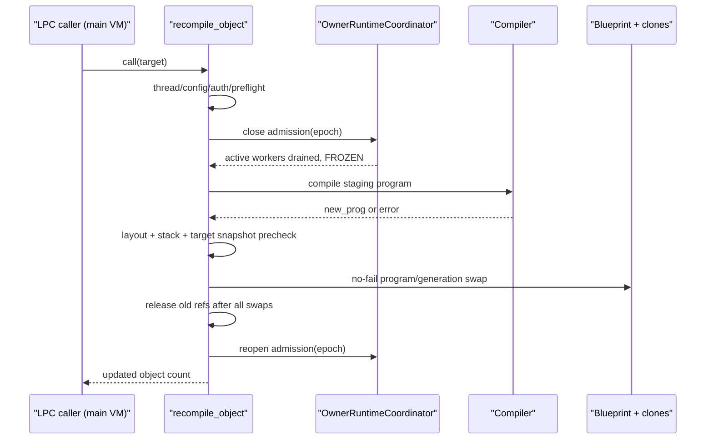

# `recompile_object()` 热重载专项设计与近期提交审计

> 状态：**DRAFT v0.4 - 第二轮审计缺口已吸收；实施继续 blocked**
> 修订日期：2026-08-16（v0.4 第二轮审计同日）
> 审计范围：`HEAD~7..HEAD`，即 `0322733b..ef4759b7`
> 当前基线：`HEAD == origin/main == ef4759b71cc0c1eea7fca71de27ca79620ef7622`；本轮修订前工作树仅本文有未提交修改
> 授权边界：本轮仅修订本 Markdown；不修改业务代码、配置或第二份正式文档，不提交、不推送、不部署
> 实施纪律：本方案不是实施授权。必须先关闭第 2、3 节的前置阻断项，再由用户单独授权 E3 代码实施

---

## 0. 结论与执行决策

### 0.0 v0.4 修订说明（第二轮审计）

v0.4 在 v0.3 基础上关闭第二轮审计发现的 5 个设计缺口，不改变 E3 的保守 v1 范围：

1. **FP_LOCAL 回收账本改为单一责任**：`reclaim_objects()` 不再提前递减 `func_ref`；最终 `dealloc_funp()` 始终按 creation-time `local.prog` 对称递减，并增加 owner destruct/reclaim/drop/memory-check 合同。
2. **class schema 纳入布局身份**：变量类型中的 class index 不再视为充分证据；布局描述符递归覆盖 class 身份、成员顺序、名称、完整类型和嵌套 schema。
3. **新 program 的 apply lookup table 在冻结期完整预热**：`new_prog->apply_lookup_table != nullptr` 成为 commit 前置条件，reopen 后 owner 首次分派不得触发懒构建。
4. **transaction guard 顺序固定**：入口先以无共享写入方式拒绝非主线程，再由主线程取得 process-local guard；guard 在 master hook 前生效，阻止 hook 嵌套重编译。
5. **R2 扩展到两个 fuzz harness**：`fuzz_compile` 与 `fuzz_restore` 都必须区分输入 I/O 失败和空输入，提供实际目标执行计数、自校准序列及 bounded AFL 证据。

v0.3 的本机复核事实继续有效：A1-A4 静态复验属实；`CFG_INT(70)/(71)` 已确认空闲；本地不存在需要纳入 E3 的 object swap-out 路径；R5 保留定向根因假设；执行环境要求见 §17.1；§7.3 的排队任务 capture 审计仍是强制项。

1. **近期七个提交不能整体维持 `accepted`。** 已确认 4 个代码级高优先级问题：
   - lws 4.5.8 升级漏掉上游 default-vhost socket adoption 修复；
   - `fuzz_compile` 在普通用户下实际无法写入 `/fuzz_compile#N.c`，仍静默返回 0；
   - OS 环境变量 efun 可从 owner worker 直接进入进程级 `getenv/setenv/unsetenv`；
   - `lpcc --owner-audit --format=json` 仅检查 `argc >= 3`，随后读取 `argv[3]`、`argv[4]`。
2. **当前回归基线不是全绿。** 在重建当前 HEAD 的 `driver` 和 `lpc_tests` 后：
   - `lpc_tests` 可稳定在 `DriverTest.TestStringIndexHandlesConcurrentEgcIterators` 触发 `SIGSEGV`，退出 139；
   - LPC 全量回归在 `bind_destruct_owner.c:28` 失败，退出 255；
   - 两项失败文件不在七提交的直接 diff 中，本审计不武断归因，但它们足以否定“12 项全量回归全绿”的收尾结论。
3. **E3 采用保守 v1，不直接对齐上游全部能力。** v1 固定为：
   - 仅主 VM 线程调用；
   - 全局关闭 owner admission，等待活跃 owner 执行归零后冻结；
   - 只允许变量和 inherit 布局完全一致；保留现有 inline `variables[1]`；
   - 不运行 `create()` 或 `__INIT`；
   - 一次更新 blueprint 及所有仍共享同一 `old_prog` 的 clones；
   - inheritor 不自动更新；master、simul_efun、virtual object、shadow、pending `replace_program()` 全部拒绝；
   - 所有可能失败的工作在交换前完成，commit 段无分配、无 LPC、无 `error()`。
4. **执行顺序不可倒置。** 先补近期提交的纠正提交和真实证据，再清理当前红色回归基线，最后才进入 E3。E3 内部先写失败合同和 owner 静默点，再做 generation、编译预检和原子交换；efun 最后注册。
5. **T3/E4 继续 deferred。** lpcshell 与 `read_source_line` 优化仍依赖本地不存在的诊断渲染基建，不进入本方案实施范围。

## 1. 审计方法、状态定义与当前证据

### 1.1 状态定义

| 状态 | 含义 |
|---|---|
| `accepted` | 实现、针对性合同、相邻回归和必要 runtime 证据均可复现 |
| `conditional` | 目标实现未发现明确缺陷，针对性证据通过，但广域基线或外部依赖仍未闭合 |
| `partial` | 有效实现已存在，但合同、文档、归属或全量门禁不完整 |
| `blocked` | 已确认正确性/安全性问题，或必要门禁为红，不能进入下一阶段 |
| `deferred` | 明确不在当前批次实施，不代表已完成 |
| `superseded` | 原文档被本版本取代，不再作为实施依据 |

### 1.2 已执行的当前 HEAD 验证

| 检查 | 结果 | 可下结论 |
|---|---|---|
| `cmake --build build-sync --target lpcc fuzz_compile fuzz_restore driver lpc_tests -j2` | 通过；出现 WSL 临时文件轻微 clock-skew 警告 | 五个目标可由当前源码构建；警告需在正式证据中保留 |
| `lpcc --owner-audit --format=json` 短参数调用 | 退出 1，但越界把 argv 后方的环境条目当成文件名 | CLI 没有按 usage 合同拒绝，存在未定义行为 |
| `lpcc --batch etc/config.test /single/tests/efuns/has_cycle` | 退出 0，目标 PASS | batch 主路径可用；不能覆盖短参数缺陷 |
| `fuzz_compile etc/config.test single/tests/efuns/has_cycle.c` | 普通用户、根目录不可写，仍退出 0；无编译成功/诊断证据 | 原“正常退出”冒烟不能证明 compiler 被 fuzz |
| `-ftest:/single/tests/efuns/{has_cycle,find_cycles,break_cycles}` | 三项分别退出 0，均输出 `Checks succeeded.` | E1 三个新增 efun 的定向 LPC 合同通过 |
| 全量 `lpc_tests` | 退出 139；定向重跑 EGC 并发测试同样崩溃 | 当前 C++ 回归门禁为红，根因待独立定位 |
| `driver etc/config.test -ftest` | 退出 255；`bind_destruct_owner.c:28` 失败 | 当前 LPC 全量门禁为红，根因待独立定位 |
| 本地 lws vendor 对上游 `8fe05a5d` | 35 个文件不同，额外 282 insertions / 24 deletions | 需要 vendor patch manifest 和来源说明 |
| `git diff --check` | 通过 | 写文档前没有空白错误或工作树改动 |

说明：第一次全量测试曾命中较旧产物；发现二进制绑定不清后，已重建当前 HEAD 的 `driver/lpc_tests` 并复跑，表中只记录重建后的结果。正式验收必须同时记录源码 SHA、二进制路径、mtime/SHA-256、命令和退出码。

## 2. `HEAD~7..HEAD` 七提交审计

### 2.1 汇总

| # | commit | 主题 | 审计状态 | 主要结论 | 下一步 |
|---|---|---|---|---|---|
| 1 | `0322733b` | lws 4.5.8（S16） | `blocked` | 漏移植 default vhost adoption；vendor 还存在未说明差异 | 纠正代码、补 manifest、跑 live WebSocket smoke |
| 2 | `a3865995` | cycles efun（E1） | `conditional` | `cycles.cc` 与上游对应文件一致；三项定向 LPC 测试通过 | 补当前 HEAD sanitizer/相邻 copy 证据，等待全量基线转绿 |
| 3 | `12316152` | fuzz harness（E2） | `blocked` | `fuzz_compile` scratch 可 no-op；compile/restore 都把 input I/O 失败当空输入并 exit 0 | 受控 scratch、两 harness I/O fail-closed、RAII、计数、自校准 |
| 4 | `61ab872e` | OS env efun（T1） | `blocked` | 缺 main-thread/串行化合同，且没有新增 efun LPC 测试 | 限定主线程、补权限/并发/空值测试和配置文档 |
| 5 | `fff68619` | `lpcc --batch`（T4） | `blocked` | owner-audit 参数检查越界；同时混入无测试的 T2 | 修 argc，补 CLI/T2 合同；不改写已推送历史 |
| 6 | `eba5b62e` | 收尾证据 | `blocked` | accepted/全绿/T2 commit 归属均与当前事实不符 | 后续单独修订证据文档并绑定原始日志 |
| 7 | `ef4759b7` | 热重载 v0.1 | `superseded` | 仅列问题，未给出可执行并发、原子性、范围和门禁方案 | 由本文 v0.2 取代 |

### 2.2 高优先级发现

#### A1. `0322733b` 漏掉 lws 4.5.8 必需的 vhost 选择

- **本地复验**：`src/net/websocket.cc:127` 确为 `lws_adopt_socket(context, fd)`，无 vhost 查找，与 v0.2 描述一致。

- 当前 `src/net/websocket.cc:126-127` 调用 `lws_adopt_socket(context, fd)`。
- lws 4.3 起 context vhost list 首项可能是内部 `system` vhost；它不携带 FluffOS 的 WebSocket protocols。
- 对应上游 `8fe05a5d` 已显式查找名为 `default` 的 vhost，并调用 `lws_adopt_socket_vhost(vhost, fd)`；本地升级未带入这段修复。
- 风险：TCP accept 成功但 WebSocket 被绑定到错误 vhost，出现握手、protocol dispatch 或发送路径异常；只跑编译和 socket 单测不足以发现。

纠正要求：

1. 移植 default-vhost 查找与空指针失败路径。
2. 增加 C++ 合同，证明找不到 default vhost 时不 adoption。
3. 启动当前 driver，分别对普通 WebSocket 和 TLS WebSocket 做真实握手、收发和断开 smoke。
4. 记录 vendor 基准 tag/commit、35 个本地差异文件、每个差异的来源和保留理由。

#### A2. `12316152` 的 compile harness 可 no-op，两个 harness 都吞输入 I/O 失败

- **本地复验**：`main_fuzz_compile.cc:76` 对象名 `/fuzz_compile#N`；`:85` `fopen(path.c_str(), "wb")` 失败时仅跳过写文件，不报错不退出，随后 `load_object("/fuzz_compile#N.c")` 失败被 `catch` 吞掉，main 返回 0；`unlink` 在 try 块内，异常路径不执行。与 v0.2 描述一致。

- `src/main_fuzz_compile.cc:76` 生成对象名 `/fuzz_compile#N`。
- `src/main_fuzz_compile.cc:84-85` 将其直接作为宿主绝对路径 `/fuzz_compile#N.c` 传给 `fopen`。
- 当前审计用户不是 root，`/` 不可写；`fopen` 失败后代码不报错，继续 `load_object()`，异常又在 `catch` 中被吞掉，最终 main 返回 0。
- `unlink` 不在统一 scope guard 中；异常路径也无法证明清理发生。
- `src/main_fuzz_compile.cc:52-62` 与 `src/main_fuzz_restore.cc:43-53` 的 `read_file()` 都把 input `fopen` 失败映射为空 vector，且不检查 `fread` 的 error bit 和 `fclose` 返回值；main 随后仍运行空序列并返回 0。因此“不存在/不可读/读取失败”目前无法与合法空输入区分。

纠正要求：

1. 在 mudlib 内建立固定、受控、不可逃逸的 scratch 目录，例如 `/data/fuzz_compile/` 对应的宿主路径。
2. 检查 `fopen`、`fwrite`、`fclose` 的完整结果；失败必须让一次 harness 输入失败，而不是伪成功。
3. 用 RAII/scope guard 在成功、编译错误和 C++ 异常路径统一删除 scratch。
4. 增加自校准：有效 LPC 必须增加 `compile_success`；无效 LPC 必须增加 `compile_diagnostic`；二者均为 0 时进程非零退出。
5. 对 `fuzz_restore` 增加独立 restore 调用计数；两个 harness 的 input `fopen/fread/fclose` 失败都必须非零退出，并用可注入 file-I/O wrapper 覆盖错误分支。
6. AFL smoke 除“进程仍活着”外，还要分别保存两个 harness 的 execs、unique paths、crash/hang 数和自校准计数。

#### A3. `61ab872e` 把进程环境直接暴露给 owner worker

- **本地复验**：`contrib.cc:3120/3147/3153` 分别在 `f_get_os_env`/`f_set_os_env` 内直接 `getenv/setenv/unsetenv`，函数体内无 `vm_context_is_main_thread()` 检查。与 v0.2 描述一致。
- 注：`contrib.cc:1837/1851` 的 `getenv("TZ")/unsetenv("TZ")` 是既有的本地时区逻辑，非本次新增，不在本纠正范围，但 R3 主线程合同落地时可一并确认其调用上下文。

- `src/packages/contrib/contrib.cc:3112-3157` 直接调用 `getenv`、`setenv`、`unsetenv`，未检查 `vm_context_is_main_thread()`，也没有主线程 adapter。
- 本地 owner executor 已允许受控 LPC 和显式开放的 ordinary LPC；因此这些 efun 不再天然只从主线程进入。
- POSIX 进程环境是全局可变状态，读写并发合同不应由不同 libc 实现的偶然行为决定。
- 提交只在 `testsuite/etc/config.test` 增加 allow-list，没有新增实际调用 efun 的测试文件，也没有生产配置说明。

v1 纠正决策：先采用 main-thread-only，稳定拒绝 owner worker；不在本批次引入异步环境变量 adapter。测试必须覆盖 readable、writable、read-only、未列出、set、unset、不存在返回 0、空名称、owner worker 拒绝，以及失败后环境未变化。

#### A4. `fff68619` 引入 `lpcc` argv 越界

- **本地复验**：`main_lpcc.cc:84-85`：`argc >= 3` 即进入分支并读取 `argv[3]`/`argv[4]`；`argc == 3`（`lpcc --owner-audit --format=json config`）时 `argv[3]` 越界读。与 v0.2 描述一致；正确检查应为 `argc == 5`。

- `src/main_lpcc.cc:84` 用 `argc >= 3` 识别完整 owner-audit 模式。
- `src/main_lpcc.cc:85` 无条件读取 `argv[3]`、`argv[4]`；完整模式实际要求 `argc == 5`。
- 当前短参数验证已观察到它读取 argv 末尾后的环境条目，而不是输出 usage 后稳定退出。
- 同文件重复 `#include <string>`。

纠正要求：先做完整模式解析，再访问参数；增加 `argc=0..6` 的表驱动 CLI 测试、未知 flag、batch 无文件/stdin、单文件、混合成功失败和退出码合同。

#### A5. `eba5b62e` 的证据结论不可作为发布门禁

- `docs/upstream-sync-evidence-2026-08.md:75-80` 将 S16/E1/E2/T1/T2/T4 全标为 `accepted`。
- T2 并没有独立的 “T2 commit”，实际与 T4 一起混入 `fff68619`。
- 当前可复现的 C++ 和 LPC 全量门禁均为红；仓库内也没有与“12 项全量回归全绿”逐项绑定的原始命令、退出码和日志摘要。

本轮不越权修改该证据文档。近期提交纠正完毕后，必须单独修订它，并保留“原结论为何被撤回”的审计轨迹。

### 2.3 中优先级发现

#### A6. `0322733b` 的 vendor 来源不可复核

完整 vendor 替换本身可以合理，但当前树相对对应上游提交仍有 35 个文件差异，包含 ws-over-h2 定制、其他源码差异和大量执行位变化。提交说明只解释部分 CMake/cache 适配，没有 patch manifest。缺少 manifest 时，后续 CVE 追踪、再升级和回归归因都会失去基准。

#### A7. `fff68619` 破坏提交原子性，T2 没有生命周期合同

提交主题是 T4 `lpcc --batch`，但同时改动 `backend.cc`、`core.spec`、`efuns_main.cc`、`object.h`，加入完整 `set_clean_up()` 实现。当前没有对应 LPC 测试，也没有真实 deadline/sweep/one-shot/恢复 idle rule 的生命周期验证。

由于提交已经位于远端 `main`，不得为追求整洁重写历史。采用两个后续纠正提交：一个只修 T4 CLI，一个只补 T2 合同、文档和必要修复；证据文档如实注明原始归属。

#### A8. `ef4759b7` 只是设计问题清单

v0.1 没有选定范围，也没有回答全 VM 静默点、变量布局、commit 无失败性、clone/inherit 语义、权限、错误合同、测试命令和阶段退出条件。其 P0 直接做 program 交换、P1 再补失败原子性的顺序不安全。本文后续章节给出替代方案。

### 2.4 未发现明确代码缺陷的提交

`a3865995` 的 `cycles.cc` 与上游 `cca57e61` 对应文件无差异；新增 `has_cycle`、`find_cycles`、`break_cycles` 三个 LPC 合同均在当前 HEAD 定向通过，覆盖 array、class、mapping key、function args、DAG 和深层无环结构。它暂定 `conditional`，原因是当前全量基线为红、copy 相邻回归和 sanitizer 尚未形成当前 HEAD 证据，不是因为本审计发现了 cycles 实现缺陷。

## 3. 纠正后的批次状态与 E3 前置门禁

| 项目 | 原记录 | 纠正状态 | 转为 `accepted` 的最低条件 |
|---|---|---|---|
| S16 lws 4.5.8 | accepted | `accepted` | 已满足：vhost 修复、vendor manifest、live ws/wss smoke（`docs/evidence/s16-ws-wss-smoke.md`）、ASan 零报告 |
| E1 cycles | accepted | `accepted` | 已满足：定向测试继续通过，copy 相邻回归和 ASan 全量零报告，全量基线转绿 |
| E2 fuzz harness | accepted | `blocked-env` | 仅剩 bounded AFL smoke 的 `afl-clang-fast` 环境；不得以自校准替代 |
| T1 OS env | accepted | `accepted` | 已满足：main-thread 合同、完整 LPC 测试、owner-worker 拒绝的 C++ 证据（canary 合同测试） |
| T2 `set_clean_up` | accepted | `accepted` | 已满足：deadline/sweep/取消/无 `clean_up`/one-shot 测试与文档，另加 deadline-sweep 集成冒烟 |
| T4 `lpcc --batch` | accepted | `accepted` | 已满足：argc 修复、CLI 表驱动合同（`TestLpccCliArgumentMatrix`）、batch 回归 |
| E3 `recompile_object` | 已授权未实施 | `blocked` | 本表前置项关闭、当前全量基线转绿、v0.4 强制合同全部进入测试门禁、另获实施授权 |
| T3 lpcshell | 未实施 | `deferred` | 只有诊断渲染基建另立项后才重评 |
| E4 source-line 优化 | deferred | `deferred` | 与 T3 一起重评 |

E3 开工前必须同时满足：

1. A1-A7 均有独立纠正提交和可复现证据。
2. EGC 并发崩溃与 `bind_destruct_owner` 失败已定位并关闭，或有经审计证明与 E3 隔离的稳定基线；不能用跳过测试代替。
3. `docs/upstream-sync-evidence-2026-08.md` 已按真实状态修订。
4. 工作树干净，源码 SHA、构建目录和实际运行二进制绑定明确。
5. 用户明确授权开始修改 E3 代码。

E3 实施期间以下 v0.4 合同是阶段退出硬门禁，不得降级为后续优化：

- P2 必须统一 FP_LOCAL creation-time program 的 `func_ref` 账本，并关闭 `reclaim_objects()` 提前递减造成的双减路径；
- P3 必须证明递归 class schema 相等，不能以 class index 或 class 名称相同代替布局兼容；
- P4 必须在 owner 仍冻结时完成新 program 的 apply lookup table 构建，不能让 reopen 后的 owner 首次分派触发分配；
- P5 入口必须先无共享写入地完成 main-thread 检查，再取得 transaction guard，且 guard 早于 master hook；
- R2 必须同时关闭 `fuzz_compile`、`fuzz_restore` 的输入 I/O、目标执行计数和自校准缺口。

## 4. E3 v1 范围合同

### 4.1 目标

- 在不 destruct 对象的前提下，把同一 blueprint program 的新函数实现原子切换到 blueprint 和全部现存 clones。
- 保留对象身份、object handle、inventory/environment、interactive 状态、heart beat、call_out、add_action/catch_tell 等对象级注册状态。
- 原样保留现有变量块；不做变量迁移，不运行初始化器。
- 在 owner/service 多核运行时中，保证任何线程都看不到一部分对象使用新 program、另一部分仍使用旧 program 的可执行中间态。
- 编译失败、布局不兼容、权限拒绝、owner 静默点超时等所有可恢复失败均保持对象集合完全不变。

### 4.2 明确非目标

- 不支持增删、重排或改类型的全局变量。
- 不支持持久变量所引用 class 的成员增删、重排、改名、改类型或嵌套 schema 变化。
- 不支持改变 inherit 变量布局；不自动递归更新 inheritor。
- 不运行 `create()`、`__INIT` 或任何 mudlib 迁移 callback。
- 不支持 master、simul_efun、virtual object、shadow 链和 pending `replace_program()`。
- 不支持在目标 program 任一帧正在 main/owner VM 上执行时替换。
- 不提供跨进程集群原子热更新；v1 只定义单 driver 进程语义。
- 不顺带实现 lpcshell、变量迁移器、通用 program epoch 框架或热更新 UI。

### 4.3 为什么选同布局且不运行 `__INIT`

本地 `object_t` 仍以 `variables[1]` 作为尾部 inline 变量块，分配大小由原 program 决定。移植上游“独立变量块 + 按名称迁移 + 每对象运行 `__INIT`”会同时扩大对象 ABI、内存审计、异常回滚和任意 LPC 重入面。v1 要求布局完全一致，因此变量块无需分配或移动；不运行 `__INIT` 则避免 initializer 触发 destruct、replace、clone 和 error，commit 可以成为真正无失败区。

代价是：初始化器源码即使变化也不会对现存对象生效。需要改变状态布局或重跑初始化逻辑时，继续使用 destruct/reload 或未来 v2 的显式迁移合同。

## 5. API、配置、权限与错误合同

### 5.1 LPC API

```c
int recompile_object(object blueprint);
```

- 参数必须是非 destructed、非 clone 的 blueprint。
- 成功返回被切换的对象数量，至少为 1；计数包含 blueprint 和仍共享精确 `old_prog` 的 clones。
- 失败抛出稳定错误，目标对象家族保持旧 program、旧 generation 和旧变量值。
- efun 不接受字符串路径，避免路径解析和对象身份语义分叉。

### 5.2 默认关闭的运行时开关

新增整数配置槽，建议使用当前空闲的 `CFG_INT(70)`：

```text
enable recompile object : 0
recompile object quiesce timeout ms : 2000
```

若第二项占用 `CFG_INT(71)`，必须同步更新 `runtime_config.h`、config 解析表、示例配置、`get_config()` 合同和边界测试。生产默认 0；只有专项测试配置显式设为 1。timeout 必须有合理上下限，0 或负值不得解释为无限等待。

### 5.3 master 授权

在 `src/vm/internal/applies` 增加 `VALID_RECOMPILE_OBJECT`，master apply 建议为：

```c
int valid_recompile_object(object caller, object target);
```

入口必须按以下固定顺序执行。第 1 步只能读取 thread-local/main-thread 身份，不得读取或写入
transaction guard；只有通过第 1 步的主线程才能竞争共享 guard。guard 覆盖后续所有路径，并在调用
master hook 前生效，因此 hook 内再次调用 `recompile_object()` 会命中嵌套拒绝：

1. `vm_context_is_main_thread()`；
2. 主线程以 RAII 方式取得 process-local transaction guard；已占用则返回 nested error；
3. runtime switch；
4. 参数是 live blueprint；
5. 调用 `valid_recompile_object(current_object, target)`；
6. target 特殊类型、执行栈、shadow、replace 状态；
7. 进入 owner quiescence；冻结后再次检查 4-6，防止 TOCTOU；
8. 读取权限、编译、预检和 commit。

非主 owner worker 与主线程并发进入时，owner 必须稳定得到 main-thread error，且不得触碰 guard；主线程不能因为 owner 的非法调用误报 nested。任何 config、参数、master、quiesce 或 prepare 失败都由同一个 RAII guard 释放路径收敛。

master/hook 缺失、返回 0、错误或返回非法值均 fail-closed。读取源码仍需以调用者 `current_object` 通过 `check_valid_path(..., "recompile_object", 0)`，master 授权不能替代文件读取授权，也不能借 target 的权限提升调用者文件访问能力。

### 5.4 稳定错误类别

测试按类别/稳定前缀断言，不依赖地址或线程号：

| 类别 | 稳定前缀 |
|---|---|
| 非主线程 | `recompile_object requires the main thread` |
| 功能关闭 | `recompile_object is disabled` |
| master 拒绝 | `recompile_object requires master authorization` |
| clone 参数 | `recompile_object requires a blueprint` |
| 特殊目标 | `recompile_object target is unsupported: <reason>` |
| 正在执行 | `recompile_object target program is executing` |
| owner 超时 | `recompile_object owner quiescence timed out` |
| 编译失败 | `recompile_object compile failed` |
| 布局不一致 | `recompile_object layout mismatch: <field>` |
| 嵌套调用 | `recompile_object transaction already active` |

## 6. 当前实现事实与 v1 强制不变量

### 6.1 当前事实

- `object_t::prog` 是对象当前 program 指针；变量存储仍内联在对象尾部。
- `program_t` 以 `ref` 管对象/inherit 等引用，以 `func_ref` 管 function pointer 引用。
- `FP_LOCAL` 当前只保存函数索引，释放时错误地依赖 owner 的“当前 program”；热重载后必须改为保存创建时 program。
- `reclaim_objects()` 当前在 destructed owner 路径手工递减 FP_LOCAL 的 `owner->prog->func_ref`，随后清空 owner；若 `dealloc_funp()` 改为按 `local.prog` 递减而不同时调整该路径，会对同一 creation-time 引用双减。
- `FP_FUNCTIONAL` 保存 program 和相对布局信息；同样需要 owner generation 快照。
- `program_t` 的 class 类型编码包含 program-local class index；仅比较变量的 `full_decl_type` 不能证明新旧 `classes/class_members` 的成员布局相同。
- apply lookup table 当前在首次 `apply_cache_lookup*()` 时懒构建；该路径会分配 `unique_ptr`/`unordered_map`，reopen 后多个 owner 同时首次分派同一新 program 会形成竞态。
- `current_prog`、control stack frame、函数索引和变量偏移都相对具体 program，不能在活跃帧中途交换。
- `OwnerProgramPin` 已用于 owner main callback adapter，但当前没有全局 quiescence gate、活跃 pin 计数或 recompile 状态。
- `vm_owner_thread_stop()` 会停止线程并做生命周期清理，不是热重载静默点，v1 不得借用它。
- 当前项目合同要求 gateway、async、DNS 等非 owner 后台线程不得解引用 live `object_t`/`program_t`；E3 开工前必须用调用点审计和合同测试再次证明。若发现其他 VM reader，必须把它纳入同一 quiescence，不能只冻结 owner 后继续实施。

### 6.2 强制不变量

1. `recompile_object()` 的入口、授权、编译、快照和 commit 全在主 VM 线程。
2. commit 前，owner worker 不再接新任务，所有已活跃 owner 执行和 worker program pin 已归零。
3. main control stack 和当前执行状态中不存在 `old_prog`。
4. 目标集合在冻结后一次性快照；commit 不再扫描可变 `obj_list`。
5. 每个目标在 commit 前仍 live、仍精确指向同一 `old_prog`、无 shadow、无 pending replace。
6. 新旧布局描述符逐字段相等；变量/inherit 比较必须递归覆盖 class schema，只比较数量、class index 或 class 名称不够。
7. commit 前预留所有 vector、对象引用、新 program 引用和新 flag 结果，并在冻结期完整构建新 program 的 apply lookup table；`new_prog->apply_lookup_table != nullptr` 是 armed 前 Debug assert。
8. commit 段不分配、不释放到可能执行 LPC 的路径、不调用 master apply、不编译、不抛 `error()`。
9. 所有对象 program 指针完成交换后，才批量释放它们持有的旧 program 引用。
10. generation 与 program 交换在同一冻结区完成；owner 重新开放前不可观察。
11. 任一可恢复失败在 commit 前发生，RAII guard 释放 staging program/对象引用并重新开放 owner admission。
12. 旧 program 的最终释放由现有 `ref/func_ref` 决定；每个 funptr 创建时增加的 `func_ref` 只能由最终 `dealloc_funp()` 对 creation-time program 递减一次，`reclaim_objects()` 不提前递减；不得强制释放仍被 inheritor 或旧 funptr 持有的 program。
13. 冻结期间保留的 owner 排队任务不得缓存 raw `program_t *`、函数表索引或变量偏移；LPC dispatch 必须在执行时按 object identity、generation 和方法名重新解析，否则 v1 必须拒绝更新该目标家族。
14. 非主线程拒绝发生在 transaction guard 的任何共享读写之前；主线程取得 guard 后才可调用 master hook，非法 owner 调用不得污染主线程的 nested 判定。
15. owner reopen 前，新 program 的普通/shared apply lookup table 必须已完整可读；reopen 后任何 owner 首次调用都只能读表或写线程安全的既有 direct cache 路径，不得触发 table 构建。

## 7. Owner 全局静默点设计

### 7.1 新状态

在 `OwnerRuntimeCoordinator` 增加受现有 runtime mutex 保护的状态，而不是另建互不协调的锁：

```text
OPEN -> CLOSING -> FROZEN -> OPEN
```

| 状态 | admission | worker claim | 已活跃任务 | main queue |
|---|---|---|---|---|
| `OPEN` | 正常 | 正常 | 正常完成 | 正常 drain |
| `CLOSING` | 新提交稳定拒绝 | 不再 claim 新任务 | 允许完成并递减 active | 不在 recompile 调用栈内 drain |
| `FROZEN` | 拒绝 | 暂停 | 必须为 0 | 保持队列，不丢任务 |

不能把“队列清空”当成静默条件：main-required 队列在 efun 同步执行期间无法 drain。v1 冻结未开始的排队任务，只等待已经 claim/执行的工作完成；重新开放后按原 FIFO 继续。

### 7.2 建议内部 API

```cpp
OwnerRecompileQuiesceResult vm_owner_recompile_quiesce_begin(
    std::chrono::milliseconds timeout);
void vm_owner_recompile_quiesce_end(uint64_t epoch) noexcept;
bool vm_owner_recompile_context_allowed() noexcept;
```

`begin` 只允许主线程调用，返回带 epoch 的 RAII guard。它在锁内把状态从 OPEN 改为 CLOSING，notify workers，然后等待：

```text
active_worker_tasks == 0
&& active_owner_claims == 0
&& active_worker_program_pins == 0
&& main_draining == false
```

条件满足后转 FROZEN。timeout、嵌套调用、shutdown/stopping 或不允许的 owner main-callback 上下文均失败并恢复 OPEN。不得无限等待，不得在持有 runtime mutex 时编译或执行 LPC。

### 7.3 admission 和 active 计数接入

- 所有 public submit 入口在创建 future、增加 object ref 或写队列前检查 gate；中央 `enqueue_owner_task_locked` 再做最终检查，防遗漏。
- 若某入口先注册 future 后才遇到 gate，必须按既有唯一消费者规则 terminalize 并 `cancel + take`，不能留下 pending。
- worker claim 成功时增加 active；所有 success/failure/exception/cancel 退出路径用 scope guard 递减并 notify。
- 将 `OwnerProgramPin` 接入所有实际执行 LPC 的 owner worker 路径，而不只保留当前 main callback adapter；worker 上构造/析构时维护 `active_worker_program_pins`。main callback pin 不计入 worker 条件，但从 owner main-drain 上下文调用 recompile 直接拒绝，避免自等待。
- 审计 `OwnerMailboxTask`、executor callback 和 main cleanup 的所有 capture：排队项只能持有 object handle/load time/owner epoch/generation/method name 或 object-free frozen data。发现 raw program/index capture 时，先改为执行时重解析或 generation-stale 拒绝，不能在文档中假定它安全。
- 在 `vm_owner_runtime_status()` 暴露固定低基数字段：state、epoch、admission_rejected、quiesce_attempt/success/timeout、active_worker_tasks、active_worker_program_pins、last_wait_us。

### 7.4 时序



## 8. 编译、布局预检与目标快照

### 8.1 Staging compile

从上游 5 个提交只复用“独立编译新 program、正确释放 compile 结果”的成熟逻辑，不移植独立变量块、`__INIT` 迁移循环，也不在 transaction 内自动加载未加载的 inherit。建议将内部实现拆成：

```cpp
StagedProgram compile_program_for_recompile(object_t *blueprint);
RecompileLayout describe_recompile_layout(program_t *prog);
std::vector<RecompileTarget> snapshot_recompile_targets(program_t *old_prog);
void commit_recompile_targets_noexcept(RecompilePrepared &prepared) noexcept;
```

`StagedProgram` 和目标引用必须 RAII。编译允许调用现有 include/inherit master applies，但此时 owner 已冻结；master apply 若尝试提交 owner 工作将收到稳定 admission rejection，不能阻塞等待。若 compiler 请求加载尚未加载的 inherit 或 inline/virtual inherit，v1 立即以 prepare 错误退出；运维编排应在调用前显式加载依赖。这样 transaction 内不会因 inherit retry 运行新对象的 `create/__INIT`。v1 的失败原子性只覆盖目标对象家族和 owner gate；授权/编译 master apply 自身的普通 mudlib 副作用仍由现有 apply 合同负责。

### 8.2 布局描述符

深度优先按实际变量块顺序生成结构化描述符，不能比较 shared-string 指针地址：

```text
RecompileLayout
  num_variables_total
  variables[] = {slot, inherit_path, name_text, full_decl_type, class_schema_digest?}
  inherits[]  = {slot, filename_text, type_mod, nested_layout_digest}
  classes[]   = {stable_id, name_text, members[], schema_digest}

ClassSchema
  stable_id = {defining_inherit_path, class_name_text}
  members[] = {slot, name_text, full_decl_type, nested_class_schema_digest?}
```

必须逐项相等：

- 变量总数；
- 每个 slot 的顺序、名称文本、声明类型和修饰符；
- inherit 数量、顺序、文件名、`type_mod` 和递归布局；
- 与变量偏移相关的 inherited layout digest。
- old/new program 及其 inherit graph 中每个 class 定义的稳定身份、成员数量、顺序、名称、完整声明类型，以及成员类型继续可达的嵌套 class schema。

program-local class index 只用于找到 `program_t::classes/class_members`，不得直接进入跨 program 的兼容判断。v1 保守比较 program/inherit graph 中完整 class 定义集合，即使某个 class 当前未被具名变量直接引用也不放行，以覆盖 `mixed` 等动态槽内可能保留的 class 值。实现应按 `{defining_inherit_path, class_name_text}` 建立稳定 ID，再以确定性顺序序列化 schema；成员类型中的 class index 替换为对应稳定 ID 和递归 digest，array/type modifier 仍保留。若存在递归引用，首次访问登记稳定 ID，回边只写该 ID，禁止无限递归。任何稳定 ID 冲突、缺失 class 定义、越界 member range 或无法规范化的类型都视为 prepare 失败，不能退化成“名称相同即兼容”。

允许函数新增、删除、改签名或改实现；函数变化通过新 program 的函数表体现。若旧 call_out/add_action 依赖已删除的函数名，后续触发时按现有“函数不存在”语义处理，不在 commit 时隐式修复。

### 8.3 冻结后的目标快照

在 staging compile 和布局通过后扫描 `obj_list`，选择：

```text
ob is live
&& ob->prog == old_prog
```

然后逐对象检查：

- 不在 main control stack；
- 无 `shadowing` / `shadowed` 链；
- 无 pending `replace_program()`；
- 对象身份/load time 未变化；
- object store/owner handle 记录仍指向同一对象。

快照时对每个目标 `add_ref`，预留新 program 的 N 个引用，预计算新 program 下的 `O_WILL_CLEAN_UP`、listener 等派生 flag。任何分配或检查失败都发生在 commit armed 之前。

## 9. 原子 commit 与 program 生命周期

### 9.1 commit 前引用账本

假设目标数为 N：

- transaction 额外 pin 住 `old_prog` 1 次；
- staging compile 持有 `new_prog` 1 次；
- commit 前为 N 个目标各准备 1 次 `new_prog` 引用；
- N 个对象原本各持有 1 次 `old_prog` 引用；
- inheritor 和旧 funptr 可能另持有旧 program 引用，不纳入目标数。

### 9.2 无失败 commit

伪代码只表达顺序，实际实现须封装为 `noexcept` 内部函数并用 Debug assert 固定前置条件：

```cpp
for (auto &target : prepared.targets) {
  target.ob->prog = prepared.new_prog;
  target.ob->prog_generation++;
  target.ob->flags =
      (target.ob->flags & ~kProgramDerivedObjectFlags) |
      target.precomputed_program_flags;
}

for (size_t i = 0; i < prepared.targets.size(); ++i) {
  program_t *old_ref = prepared.old_prog;
  free_prog(&old_ref);
}
```

变量指针和变量内容完全不动；flag 写入只覆盖明确列举的 program-derived bit，绝不能覆盖 interactive、destruct、hidden、owner 等对象状态。全部对象完成 program/generation 交换后才释放对象原有的 N 个旧引用；transaction pin 确保旧 program 不会在 commit 循环中途析构。最后释放 staging 自身引用和 transaction pin，再开放 owner。

commit 段禁止：

- `std::vector` 扩容、字符串构造、mapping/array/object 分配；
- `error()`、C++ 可恢复异常、master apply、`create/__INIT`；
- destruct、clone、replace、shadow 操作；
- owner submit/watch/take；
- 日志格式化和可能分配的观测上报。

计时和 outcome 在 commit 前后用预分配/原子计数记录。

### 9.3 apply cache 和派生状态

- 新 program 使用自己的 per-program apply lookup table，交换前不得把旧表复制过去。
- 将当前 `apply_cache.cc` 内部的懒构建逻辑抽成可显式调用的 prepare API（如 `prepare_apply_lookup_table(program_t *)`）：在 owner FROZEN 且 new program 尚未发布时，递归加入本 program 和 inherits 的全部可调用函数；分配/重复键/异常均在 commit armed 前处理。
- 构建应先在局部 `unique_ptr` 中完成，成功后一次赋给 `new_prog->apply_lookup_table`；失败时保持 live 对象和旧 program 不变。commit 入口 Debug assert `new_prog->apply_lookup_table != nullptr`，并可记录条目数用于证据。
- 审计 `apply_shared_single_cache_prog`、direct cache 和所有按 program 指针/函数索引缓存的路径；需要失效的缓存必须在 prepare 阶段形成无失败操作清单。reopen 后多个 owner 对新 program 的首次普通/shared lookup 不得再次进入 table builder。
- master/simul_efun v1 被拒绝，因此不需要重建全局 apply/simul dispatch table。
- heart beat、call_out、interactive、inventory 和 object store 记录属于对象身份状态，保持不变；函数存在性派生 flag 用新 program 预计算后在 commit 一起写入。“预计算派生 flag”不能代替 apply lookup table 的显式完整预热。

## 10. Function pointer generation 与旧 program 释放

### 10.1 数据结构

- `object_t` 增加 `uint64_t prog_generation`，对象初始化为 0；成功交换时递增一次。
- `funptr_hdr_t` 增加创建/绑定时的 `owner_gen`。
- `local_ptr_t` 增加创建时 `program_t *prog`，它既是索引所属 program，也是 `func_ref` 的对称记账对象。
- FP_LOCAL、FP_FUNCTIONAL 创建和 bind 均快照 owner generation。

### 10.2 调用与释放

`call_function_pointer()` 在设置 frame、合并参数或读取函数索引前检查：

```text
FP_LOCAL or FP_FUNCTIONAL
&& funp.owner_gen != funp.owner.prog_generation
=> stable stale-function-pointer error
```

旧 funptr 继续持有创建时 program 的 `func_ref`，因此错误消息格式化和释放期间 program 不会悬空。`dealloc_funp()` 对 FP_LOCAL 必须递减 `funp->f.local.prog`，不能递减 `owner->prog`。新交换后的 funptr 正常快照新 generation。

generation 使用 64 位；测试通过直接设置接近上限验证比较语义，但生产不实现回绕复用。若检测到 `UINT64_MAX`，在 prepare 阶段拒绝本次更新，不能回绕到旧 funptr generation。

### 10.3 `reclaim_objects()` 对称账本

FP_LOCAL 创建时固定执行一次 `local.prog = owner->prog` 和 `local.prog->func_ref++`。owner 被 destruct 后，`reclaim_objects()` 可以释放并清空 `hdr.owner`，但不得再手工递减任何 program 的 `func_ref`；funptr 仍通过 `local.prog` pin 住创建时 program。funptr 最终引用归零时，`dealloc_funp()` 无论 owner 是否已被 reclaim，都只对 `local.prog` 递减一次并在 `ref == 0 && func_ref == 0` 时沿现有路径释放 program。

因此 `src/packages/core/reclaim.cc` 中当前 FP_LOCAL 特判的 `owner->prog->func_ref--`/`deallocate_program()` 分支必须移除或改造成不碰 program 账本的 owner detach；不得通过清空 `local.prog` 或改写 funptr type 来掩盖双减。Debug memory walk、`checkmemory()` 和 `%O` 格式化也必须在 owner 为 null 时从 creation-time program 读取可用信息。最低生命周期合同为：`recompile -> destruct owner -> reclaim_objects -> drop funptr -> Debug memory check`，中间每一步断言旧 program 仍存活或仅在最后一个 `ref/func_ref` 消失后释放。

## 11. 对象类型与行为语义

| 场景 | v1 行为 | 理由/后续 |
|---|---|---|
| blueprint | 支持 | API 唯一入口 |
| 共享同一 `old_prog` 的 clone | 同一 transaction 全部更新 | 防止同一对象家族出现半新半旧 |
| 单独传 clone | 拒绝 | 调用意图必须明确 |
| inheritor program/object | 不自动更新 | 仍可依赖旧 parent program ref；按 parent-first 独立批次重编译 |
| 变量布局变化 | 拒绝 | v1 不迁移 inline 变量块 |
| initializer 变化 | 不执行 | 现存变量原样保留 |
| `create()` / `__INIT` | 不执行 | 保持 commit 无 LPC/无失败 |
| master | 拒绝 | 全局 apply table 和授权自举留给 v2 |
| simul_efun | 拒绝 | 全局 simul dispatch 重建留给 v2 |
| virtual object | 拒绝 | source/program identity 和 compile_object 重入留给 v2 |
| shadowing 或被 shadow | 整个目标集合拒绝 | 回调和双向链生存性留给 v2 |
| pending `replace_program()` | 整个目标集合拒绝 | 避免旧布局延迟应用到新 program |
| 目标 program 正在执行 | 拒绝 | frame PC/函数索引/变量偏移属于旧 program |
| interactive clone | 无 shadow/replace 且已静默时支持 | 对象身份、socket、inventory 不变 |
| heart beat/call_out/add_action/catch_tell | 对象级注册保留 | 必须以运行时合同验证新函数分派和删除函数错误 |
| 旧 local/functional funptr | 稳定报 stale | 不猜测同名函数是否兼容 |
| 新 funptr | 正常调用 | 快照新 generation |

多文件依赖批次由 mudlib orchestration 负责：先更新父 program，再按拓扑顺序逐个更新 inheritor。每个 `recompile_object()` 调用各自原子；v1 不承诺多个 program 之间的事务原子性。任一子项失败时停止后续批次，已成功的父项不自动回滚。

## 12. 失败原子性

| 失败点 | 是否已触碰 live program | 处理 | 可观察结果 |
|---|---|---|---|
| 非主线程/关闭/未授权/非法 target | 否 | 直接错误 | 目标对象家族不变 |
| owner CLOSING timeout/shutdown | 否 | 恢复 OPEN，notify | 队列和对象不变 |
| 源文件读取/编译/inherit 失败 | 否 | 释放 staging，恢复 OPEN | 目标对象家族不变；不自动加载 inherit |
| 布局不一致 | 否 | 释放 staging，报告首个差异 | 目标对象家族不变 |
| main stack/target 快照复检失败 | 否 | 释放 refs，恢复 OPEN | 目标对象家族不变 |
| prepare 分配失败 | 否 | C++ guard 清理，转稳定错误 | 目标对象家族不变 |
| commit | 是 | 设计为无失败，不提供中途 recoverable branch | 全部目标一次切换 |
| 旧 program 延迟释放 | 已全部切换 | 由 `ref/func_ref` 正常收敛 | inheritor/旧 funptr 可继续 pin 旧 program |
| owner reopen | 已全部切换 | epoch 匹配后 OPEN + notify_all | 排队任务在新 program 上继续 |

若 Debug assert 发现 commit 前置条件在 armed 后被破坏，这是 driver 内部不变量损坏，不得抛 LPC error 后带着半交换状态继续服务；测试构建应立即 fail-fast 并保存 core。正式实现必须靠 prepare 证明该路径不可达，而不是把 crash 当回滚方案。

## 13. 文件级实施清单

| 文件/区域 | 责任 | 明确不做 |
|---|---|---|
| `src/vm/internal/owner_runtime_coordinator.{h,cc}` | quiesce state/epoch/CV/active 计数 | 不新建第二套 runtime 锁 |
| `src/vm/internal/owner.cc`, `src/vm/owner.h` | admission、worker active/pin、RAII guard、status 字段 | 不调用 `vm_owner_thread_stop()` 实现静默 |
| `src/vm/internal/base/object.h` | `prog_generation` | 不改为独立 variables allocation |
| `src/vm/internal/base/function.{h,cc}` | owner_gen、FP_LOCAL 创建时 program、stale 检查和对称释放 | 不按函数名自动重绑旧 funptr |
| `src/packages/core/reclaim.cc` | destructed funptr owner detach；移除 FP_LOCAL 提前 `func_ref` 递减 | 不让 reclaim 与 `dealloc_funp()` 重复结账 |
| `src/vm/internal/base/program.{h,cc}`, `class.h` | 从 `classes/class_members/strings` 读取并规范化递归 class schema | 不把 program-local class index 当稳定身份 |
| `src/vm/internal/base/apply_cache.{h,cc}` | 暴露冻结期显式预热 API、完整构表和 cache 失效合同 | 不允许 reopen 后对 new program 懒构建 lookup table |
| `src/vm/internal/simulate.{h,cc}` | staging compile、layout、target snapshot、transaction/commit | 不运行 `__INIT/create` |
| `src/main_fuzz_compile.cc`, `src/main_fuzz_restore.cc` | R2 输入 I/O fail-closed、目标调用计数、稳定自校准摘要；compile scratch RAII | 不把 I/O 失败、零次目标执行当成功 fuzz case |
| `src/tests/fuzz/` 与 fuzz CTest | 两 harness 的 I/O fault injection、valid/invalid/mixed corpus | 不依赖 root/chmod 偶然覆盖错误分支 |
| `src/packages/core/efuns_main.cc`, `core.spec` | 最终 efun wrapper/注册 | 内部阶段不提前暴露 efun |
| `src/vm/internal/applies`, master 生成物 | `VALID_RECOMPILE_OBJECT` | 不复用文件读权限代替管理授权 |
| `src/include/runtime_config.h`, `src/base/internal/rc.cc` | 默认关闭和 timeout 配置 | 不解释 0 为无限等待 |
| `src/packages/core/vm_owner.cc` / owner status | 暴露低基数 quiesce 状态和计数 | 不在热路径拼高基数 target 名 |
| `src/base/internal/debugmalloc.h`, `src/packages/develop/checkmemory.cc`, `src/packages/core/sprintf.cc` | 新 funptr/program ref 的内存审计和 `%O` 展示 | 不遗漏旧 program `func_ref` |
| `src/tests/test_lpc.cc` 及 owner runtime tests | C++ 原子性、admission、active/pin、refcount 合同 | 不只做源码字符串断言 |
| `testsuite/single/tests/efuns/recompile_object.c` + fixtures | LPC 行为、权限、clone、失败、回调合同 | v1 fixture 不测试变量迁移成功 |
| efun/config/hot-reload 文档 | 用户语义、限制、错误与运维步骤 | 不宣称支持上游全部能力 |

具体编辑前必须用符号重新定位；表中路径是当前 HEAD 责任边界，不是永久行号合同。

## 14. 分阶段实施计划

### 14.1 R 系列：先修近期提交和基线

| 阶段 | 工作 | 验证 | 建议纠正 commit |
|---|---|---|---|
| R0 | 固化七提交审计、命令和二进制绑定 | SHA/路径/退出码齐全 | 本文，不提交除非另获授权 |
| R1 | 修 S16 default-vhost；生成 vendor patch manifest | C++ + live ws/wss smoke | `fix(lws): adopt accepted sockets on default vhost` |
| R2 | 同时修 `fuzz_compile`/`fuzz_restore` 输入 I/O；修 compile scratch I/O/RAII；分别增加执行计数和自校准 | 两 harness 的 fopen/fread/fclose fault matrix + valid/invalid sequence + bounded AFL | `fix(fuzz): make harnesses fail closed and self-validating` |
| R3 | OS env efun main-thread-only、测试和配置文档 | 权限/空值/set/unset/owner 拒绝 | `fix(contrib): serialize process environment access` |
| R4a | 修 owner-audit argc、重复 include、CLI tests | argc 矩阵 + batch/stdin | `fix(lpcc): validate audit and batch arguments` |
| R4b | 为 T2 补真实 cleanup lifecycle 合同及必要修复 | deadline/one-shot/cancel/idle sweep | `test(core): cover set_clean_up lifecycle` |
| R5 | 定位 EGC SIGSEGV 与 bind owner 失败；修订证据文档 | C++/LPC 全量转绿 | 按根因拆分；证据单独 docs commit |

R5 定向根因假设（v0.3 补充，执行时优先验证）：

- `DriverTest.TestStringIndexHandlesConcurrentEgcIterators` SIGSEGV：该测试与 P2（#1344）移植的 EGC/string-char lvalue 并发语义强相关（`global_lvalue_codepoint`/`global_lvalue_codepoint_sv` 的共享全局再武装路径）；优先核对本地 `svalue.h` 的 `ref_t` codepoint 字段与 interpret.cc 的 F_REF/F_REF_LVALUE 是否与上游 #1342/#1344 后的结构一致（本地曾确认 svalue.h 缺上游 ref_t 的 owner string/EGC index 字段）。
- `bind_destruct_owner.c:28` 失败：该测试源自 S7 移植（`valid_bind()` destruct 新 owner 检查，`f_bind` 的 `sp->type != T_OBJECT` 分支）；优先核对本地 `f_bind` 的栈槽检查时序与 `remove_object_from_stack` 的相互作用，以及 master 的 `set_bind_hook` 注册是否被后续提交破坏。
- 两项失败均不允许通过放宽断言或过滤测试掩盖；必须给出根因 commit 级归因。

R1-R5 每项独立 diff、独立验证。禁止把 E3 代码混入纠正提交，也不重写已推送的七提交历史。

R2 的实现边界还包括：两个 `read_file()` 必须返回“数据或明确错误”，不能把 `fopen/fread/fclose` 失败折叠为空输入；输入文件不存在、不可读、读取中失败或关闭失败均打印稳定诊断并非零退出。`fuzz_compile` 的 scratch create/write/flush/close/unlink 也必须由 RAII 收敛，写入或清理失败不能继续伪装成一次有效 compiler 执行。两个 harness 各自维护目标调用计数，并用仓内 valid/invalid sequence 做自校准：进程退出 0 之前必须证明至少一次真实 compiler/restore 入口被调用；语法/反序列化拒绝仍是正常 fuzz 结果，宿主 I/O 或“零次执行”才是 harness failure。为稳定覆盖 `fread/fclose` 等难以由权限构造的分支，应给 file-I/O wrapper 提供测试注入点，不能依赖以 root 运行时不可靠的 chmod 场景。

### 14.2 P 系列：E3 实施

#### P0 - 红灯合同和内部骨架

- 先加入 disabled、permission、main/owner 并发入口、owner-worker、layout/class-schema mismatch、clone set、active frame、quiesce timeout、stale funptr 和 apply table 未预热的失败测试。
- 建立内部 `RecompilePrepared`/RAII 类型，但不在 `core.spec` 注册 efun。
- 证明测试只因目标内部 API 尚未实现而红，不得用 crash 作为预期失败。

退出条件：测试可重复红；无正式 LPC API 暴露；普通构建不改变行为。

#### P1 - Owner quiescence

- 在现有 coordinator mutex/CV 下实现 OPEN/CLOSING/FROZEN。
- 接齐 admission、claim、active task、worker program pin 和 shutdown 交互。
- 覆盖排队任务保留、活跃任务完成、timeout reopen、future 不泄漏、FIFO 不变。

退出条件：纯 owner C++ 合同通过，TSan 定向通过；尚无 program 交换。

#### P2 - Program generation 和 funptr 生命周期

- 增加 64 位 `prog_generation`、`owner_gen` 和 FP_LOCAL creation-time program。
- 修创建、bind、调用、释放、`reclaim_objects()`、debugmalloc/checkmemory/sprintf，保证 creation-time `func_ref` 只由最终析构对称递减一次。
- 用测试钉住旧 funptr stale、新 funptr 正常、旧 program 延迟释放、owner destruct/reclaim/drop 顺序和无 refcount 泄漏。

退出条件：不触发 recompile 时现有 funptr 行为不变；Debug memory check 通过。

#### P3 - Staging compile 与布局合同

- 从上游逻辑裁剪 staging compile；未加载/inline/virtual inherit 稳定拒绝，不做 transaction 内 retry/load。
- 实现结构化 layout descriptor、稳定 class ID、递归 class schema digest 与首差异诊断；覆盖成员增删、重排、改名、改类型和嵌套变化。
- 编译错误、权限错误、布局差异均证明 live object 不变。

退出条件：只产生/释放 staging program；没有任何 live program pointer 写入。

#### P4 - Target snapshot 与无失败 commit

- 冻结后快照 blueprint+clones，检查 stack/shadow/replace/special target。
- 预备 N 个新 program ref、对象 ref 和派生 flags；显式完整构建 new program apply lookup table。
- 实现 `commit_recompile_targets_noexcept()`；commit 后统一释放旧 refs。

退出条件：C++ fault-injection 证明所有可注入失败都在 armed 前；`new_prog->apply_lookup_table != nullptr` 前置断言成立；并发观察合同看不到半交换，reopen 后多 owner 首次分派不分配、不竞态。

#### P5 - efun、配置和 master 授权

- 增加 runtime config、master apply、wrapper 和稳定错误。
- 固定 main-thread check -> transaction guard -> config/target -> master hook 顺序，并覆盖 main/owner 并发调用与 hook 嵌套调用。
- 先保持 `enable recompile object : 0` 验证普通回归；专项 testsuite 配置单独启用。
- 这是首次在 `core.spec` 注册 efun。

退出条件：默认配置下调用稳定拒绝；授权测试配置下完整矩阵通过。

#### P6 - 回调、依赖顺序、观测和文档

- 验证 heart beat、call_out、add_action、catch_tell、interactive identity。
- 增加 parent-first orchestration fixture，明确多 program 不原子。
- 在 owner runtime status 加低基数 outcome/timing；写 efun 和 hot-reload 运维文档。

退出条件：运行时状态可区分 success、各拒绝原因、timeout；文档与实际错误一致。

#### P7 - sanitizer、全量回归和最终门禁

- 普通 Release、ASan+UBSan、TSan 分离构建。
- C++ 全量、LPC 全量、定向 runtime、多 owner 重复热重载和 Debug memory check。
- 审阅 staged diff、生成文件、证据文档和二进制绑定。

退出条件：第 18 节全部满足后，E3 才能从 `blocked` 转 `accepted`。

## 15. 详细测试矩阵

### 15.1 API 与权限

| ID | 场景 | 期望 |
|---|---|---|
| API-01 | 默认配置调用 | disabled，目标不变 |
| API-02 | master hook 缺失/0/error | fail-closed，目标不变 |
| API-03 | 授权通过 | 进入 prepare |
| API-04 | owner worker 直接调用 | main-thread error；guard 零读写；无 owner/future 泄漏 |
| API-05 | clone 参数/destructed object/null-like invalid | 稳定参数错误 |
| API-06 | 嵌套 recompile | 第二次稳定拒绝，外层不受污染 |
| API-07 | main 与 owner 并发调用同一 target | owner 稳定得到 main-thread error；main 不误报 nested；guard 最终释放 |

### 15.2 Program、变量和对象家族

| ID | 场景 | 期望 |
|---|---|---|
| OBJ-01 | 只改函数体 | blueprint identity 不变，新代码生效 |
| OBJ-02 | blueprint + 多 clones 各有不同变量值 | 返回 N；所有 identity 不变；各自变量原样保留 |
| OBJ-03 | initializer 值变化、布局不变 | 现存对象仍是旧值，证明 `__INIT` 未运行 |
| OBJ-04 | 增/删/重排/改类型变量 | layout mismatch；全部仍运行旧代码 |
| OBJ-05 | inherit 顺序/type_mod/父布局变化 | mismatch；无部分交换 |
| OBJ-06 | 先父后子分别更新 | 两次各自成功；子在第二次后使用新父 program |
| OBJ-07 | 只更新父，不更新现存子 | 子继续 pin/使用旧父，行为有文档化 |
| OBJ-08 | clone 在 snapshot 前/后边界 | 冻结后集合稳定；不存在漏更新 live `old_prog` clone |
| OBJ-09 | 持久变量 class 增加/删除成员 | class schema mismatch；旧值不被新代码解释 |
| OBJ-10 | class 成员重排/改名 | class schema mismatch；即使成员数和类型集合相同也拒绝 |
| OBJ-11 | class 成员改类型或嵌套 class schema 变化 | 递归 mismatch 定位到首个 class/member；无部分交换 |

### 15.3 执行、特殊对象和回调

| ID | 场景 | 期望 |
|---|---|---|
| RUN-01 | target 自己调用 recompile | executing error |
| RUN-02 | main stack 深层仍含 old program | executing error |
| RUN-03 | owner task 正执行 old program | 等待完成后更新，或 timeout 原子失败 |
| RUN-04 | pending `replace_program` | 整个对象家族拒绝 |
| RUN-05 | shadowing/被 shadow | 拒绝 |
| RUN-06 | master/simul/virtual | 各自 stable unsupported reason |
| RUN-07 | interactive clone idle | socket/session/inventory/object handle 不变，新代码生效 |
| RUN-08 | heart beat/call_out 注册后更新 | 注册保留，下一次按新 program 分派 |
| RUN-09 | add_action/catch_tell 注册后更新 | 对象引用有效；新函数或明确 missing-function 语义 |

### 15.4 Funptr 和 program 生命周期

| ID | 场景 | 期望 |
|---|---|---|
| FP-01 | 旧 FP_LOCAL 更新后调用 | stale error，不读新索引 |
| FP-02 | 旧 FP_FUNCTIONAL 更新后调用 | stale error，不读旧变量偏移 |
| FP-03 | bind 前后 generation | 新 bind 快照正确；旧 pointer 仍 stale |
| FP-04 | 更新后创建新 funptr | 正常调用新函数 |
| FP-05 | 释放旧 funptr | 递减创建时 program 的 `func_ref` |
| FP-06 | inheritor + 旧 funptr 同时 pin 旧 program | 最后一个 ref/func_ref 消失后才释放 |
| FP-07 | generation 接近 `UINT64_MAX` | prepare 拒绝溢出，不回绕复活旧 funptr |
| FP-08 | recompile -> destruct owner -> reclaim -> drop FP_LOCAL -> memory check | reclaim 不提前减；drop 只减 creation-time program 一次；旧 program 恰在最后引用消失后释放 |

### 15.5 Owner quiescence 与失败原子性

| ID | 场景 | 期望 |
|---|---|---|
| OWN-01 | OPEN 下普通 submit | 行为不变 |
| OWN-02 | CLOSING/FROZEN 下新 submit | 稳定 rejection；无 ref/future 泄漏 |
| OWN-03 | 已排队未 claim 任务 | 冻结期间不执行，OPEN 后保持 FIFO |
| OWN-04 | 已活跃任务正常/异常完成 | active/pin 均归零并唤醒 quiesce |
| OWN-05 | quiesce timeout | OPEN 恢复；对象/program/generation 不变 |
| OWN-06 | shutdown 与 recompile 竞态 | 无死锁；recompile 失败；shutdown 继续 |
| OWN-07 | compile error/读取错误/inherit error | owner reopen，live set 不变 |
| OWN-08 | layout/snapshot/ref prepare fault injection | commit 未 armed，live set 不变 |
| OWN-09 | 多观察线程读取对象家族 | 只能观察全 old 或全 new，不能观察混合状态 |
| OWN-10 | 连续重复热重载 1000 次 | generation、refcount、队列和内存稳定 |
| OWN-11 | gateway/async/DNS 等非 owner 后台线程审计 | 不存在 live object/program reader；否则测试红并扩展 quiescence |
| OWN-12 | 冻结时存在目标家族的排队 owner LPC/callback | 不含 raw program/index；reopen 后按 identity/generation/method 解析或 stale 拒绝 |
| OWN-13 | reopen 后多个 owner 同时首次调用 new program | lookup table 已在冻结期完整构建；并发只读该表，无分配、重复构建或 TSan race |

### 15.6 R2 fuzz harness 合同

| ID | 场景 | 期望 |
|---|---|---|
| FZ-01 | compile/restore 输入文件不存在 | 稳定 I/O 诊断，非零退出，目标执行计数为 0 |
| FZ-02 | compile/restore 输入文件不可读 | 稳定 `fopen` 错误，非零退出；用非特权进程或确定性 fault injection 验证 |
| FZ-03 | 注入 input `fread`/`fclose` 失败 | 两个 harness 都非零退出，不把已读前缀或空 vector 当成功输入 |
| FZ-04 | compile scratch create/write/flush/close/unlink 失败 | 非零退出；RAII 清理已创建 scratch；compiler 执行计数不得虚增 |
| FZ-05 | 每个 harness 的 valid sequence | 退出 0；目标实际调用计数与 chunk 数匹配且大于 0 |
| FZ-06 | 每个 harness 的 invalid/mixed sequence | 目标入口仍被调用；普通语法/restore 拒绝被捕获；自校准通过 |
| FZ-07 | 两个 harness 各自 bounded AFL | `execs_done > 0`、无零执行/路径失联警告；保留命令、时限、stats 和退出码 |

## 16. 构建、运行与 sanitizer 命令

### 16.1 每阶段最小门禁

```bash
cmake --build build-sync \
  --target driver lpcc lpc_tests ofile_tests -j2

ctest --test-dir build-sync --output-on-failure

cd testsuite
../build-sync/bin/driver etc/config.test \
  -ftest:/single/tests/efuns/recompile_object
../build-sync/bin/driver etc/config.test -ftest
```

owner quiescence/funptr/原子性 C++ 测试应使用精确 `--gtest_filter` 先定向运行，再进入完整 CTest。每条命令必须保留真实退出码；不得用 `|| true`、过滤日志或跳过失败测试制造绿灯。

### 16.2 Release 与 ASan+UBSan

```bash
cmake -S . -B build-recompile-release \
  -DCMAKE_BUILD_TYPE=Release -DMARCH_NATIVE=OFF
cmake --build build-recompile-release \
  --target driver lpcc lpc_tests ofile_tests -j2
ctest --test-dir build-recompile-release --output-on-failure

cmake -S . -B build-recompile-asan-ubsan \
  -DCMAKE_BUILD_TYPE=RelWithDebInfo \
  -DENABLE_ASAN=ON -DENABLE_UBSAN=ON \
  -DENABLE_LTO=OFF -DMARCH_NATIVE=OFF
cmake --build build-recompile-asan-ubsan \
  --target driver lpcc lpc_tests ofile_tests -j2
ctest --test-dir build-recompile-asan-ubsan --output-on-failure
```

### 16.3 TSan

```bash
cmake -S . -B build-recompile-tsan \
  -DCMAKE_BUILD_TYPE=RelWithDebInfo \
  -DENABLE_TSAN=ON -DENABLE_LTO=OFF -DMARCH_NATIVE=OFF
cmake --build build-recompile-tsan \
  --target driver lpc_tests ofile_tests -j2
ctest --test-dir build-recompile-tsan --output-on-failure

tools/testsuite/run-isolated.sh \
  --driver build-recompile-tsan/bin/driver --mode audit
```

ASan/UBSan 与 TSan 使用独立构建目录，不混用。TSan 发现必须分类到目标代码、已有基线或第三方库，并保存完整栈；不能仅以“疑似误报”关闭。

### 16.4 R2 fuzz 配置、构建、自校准与 bounded AFL

R2 应新增 `src/tests/fuzz/corpus/compile/` 和 `src/tests/fuzz/corpus/restore/` 的最小 valid/invalid/mixed sequence；harness 成功自校准时输出一行稳定摘要，例如 `HARNESS_OK target=<name> executions=<N> chunks=<M>`。AFL 构建必须从干净独立目录显式打开 `BUILD_FUZZERS`：

```bash
cmake -S . -B build-fuzz-afl \
  -DCMAKE_BUILD_TYPE=RelWithDebInfo \
  -DBUILD_FUZZERS=ON \
  -DCMAKE_C_COMPILER=afl-clang-fast \
  -DCMAKE_CXX_COMPILER=afl-clang-fast++ \
  -DENABLE_LTO=OFF -DMARCH_NATIVE=OFF
cmake --build build-fuzz-afl \
  --target fuzz_compile fuzz_restore -j2

cd testsuite
../build-fuzz-afl/bin/fuzz_compile etc/config.test \
  ../src/tests/fuzz/corpus/compile/valid_sequence \
  2>../build-fuzz-afl/fuzz-compile-selfcheck.log
rg '^HARNESS_OK target=compile executions=[1-9][0-9]* ' \
  ../build-fuzz-afl/fuzz-compile-selfcheck.log

../build-fuzz-afl/bin/fuzz_restore etc/config.test \
  ../src/tests/fuzz/corpus/restore/valid_sequence \
  2>../build-fuzz-afl/fuzz-restore-selfcheck.log
rg '^HARNESS_OK target=restore executions=[1-9][0-9]* ' \
  ../build-fuzz-afl/fuzz-restore-selfcheck.log

if ../build-fuzz-afl/bin/fuzz_compile etc/config.test \
  /definitely-not-present/fuzz-input; then
  echo 'expected fuzz_compile input I/O failure' >&2
  exit 1
else
  compile_io_rc=$?
fi
test "$compile_io_rc" -ne 0

if ../build-fuzz-afl/bin/fuzz_restore etc/config.test \
  /definitely-not-present/fuzz-input; then
  echo 'expected fuzz_restore input I/O failure' >&2
  exit 1
else
  restore_io_rc=$?
fi
test "$restore_io_rc" -ne 0
```

FZ-02 至 FZ-04 的注入测试进入普通 CTest，不能只靠手工命令。自校准和 I/O 负例通过后，再分别运行 bounded AFL；两个 harness 不共享输出目录：

```bash
cd testsuite
AFL_NO_UI=1 afl-fuzz -V 60 \
  -i ../src/tests/fuzz/corpus/compile \
  -o ../build-fuzz-afl/afl-compile -- \
  ../build-fuzz-afl/bin/fuzz_compile etc/config.test @@

AFL_NO_UI=1 afl-fuzz -V 60 \
  -i ../src/tests/fuzz/corpus/restore \
  -o ../build-fuzz-afl/afl-restore -- \
  ../build-fuzz-afl/bin/fuzz_restore etc/config.test @@
```

验收时分别保存两个输出目录的 `fuzzer_stats`，确认 `execs_done > 0`、无 harness 自检失败，并记录 AFL 版本、60 秒时限和真实退出码。若 AFL 工具链缺失，R2 保持 `BLOCKED-env`；自校准通过不能替代 bounded AFL 门禁。

### 16.5 最终静态和证据检查

```bash
git status --short --branch
git diff --check
git diff --stat
git diff --name-only
git diff --cached --check
```

只 stage 当前阶段 task-owned 文件。任何生成物、日志、core、trace 或测试 scratch 必须确认是否被忽略；不得把它们误提交，也不得删除用户已有数据。

## 17. 证据格式、停止条件与回滚

### 17.1 执行环境要求（v0.3 新增）

R/P 系列开工前确认以下工具可用，并在首条证据记录中登记版本：

- `bash`、`cmake`（≥3.22）、`gcc`/`g++`（构建已验证的编译器版本）
- `ctest`、`git`（含 `git worktree`，如需隔离验证）
- ASan/UBSan/TSan 构建所需的 sanitizer 运行时（`build-recompile-*` 独立目录）
- `tools/testsuite/run-isolated.sh` 依赖的 `python3` 与端口隔离脚本
- R2 验收必需的 AFL++ `afl-clang-fast`、`afl-clang-fast++`、`afl-fuzz`；缺失时 R2 标记 `BLOCKED-env`，不得以自校准序列替代

任何一项缺失时，对应阶段标记 `BLOCKED-env` 并停止，不得用"逻辑上应该能过"替代实际运行。

### 17.2 每个阶段的证据记录

```text
phase:
source_head:
worktree_status:
build_dir:
binary_path:
binary_sha256:
command:
cwd:
started_at / duration:
exit_code:
result: PASS | FAIL | BLOCKED
log_path / log_sha256:
key_assertions:
known_gaps:
```

`PASS` 只用于命令实际退出 0 且关键断言被执行；“未崩溃”“能构建”“日志里没看到错误”不能替代业务断言。外部 live smoke 还需记录端口、协议、请求/响应摘要和清理结果，但不得写入密钥、token 或私有连接参数。

### 17.3 立即停止条件

出现任一项即停止推进，不注册/不开启 efun：

- 当前基线 C++ 或 LPC 全量门禁仍为红；
- quiesce 可能无限等待、丢排队任务、破坏 FIFO 或泄漏 future/ref；
- commit armed 后仍存在分配、LPC、`error()` 或可恢复异常；
- 变量/inherit 布局比较无法证明覆盖实际 slot 顺序，或持久 class schema 无法递归规范化；
- new program 的 apply lookup table 未在 FROZEN 阶段完成构建，或 reopen 后首次 lookup 仍可能分配；
- `reclaim_objects()` 与 `dealloc_funp()` 可能对同一 FP_LOCAL creation-time `func_ref` 重复递减；
- 非主线程在 main-thread rejection 前触碰 transaction guard，或 master hook 在 guard 建立前运行；
- 观察到半更新对象家族、旧 funptr 调入新索引、program 提前释放；
- master/simul/virtual/shadow/replace 通过未审计旁路进入 v1；
- sanitizer 报告 UAF、double free、race、leak 或未分类 crash；
- 实际运行二进制不能绑定到当前源码 SHA；
- 出现并行用户改动且无法无覆盖地继续。

### 17.4 回滚

- 生产第一回滚手段是保持 `enable recompile object : 0`；默认配置从始至终关闭。
- 代码尚未合入时，仅撤销当前阶段 task-owned diff；不得 reset 或覆盖并行修改。
- 已形成纠正提交时按反向依赖逐项 revert，不 force-push、不重写七提交历史。
- 一次成功热重载不会在 v1 自动回滚到旧 program；若新逻辑虽编译成功但业务错误，需从已知良好源码再次执行同布局 recompile，或按运维流程重启/恢复。
- 任一 commit 内部不变量破坏导致 fail-fast 时，保存 core/日志并停止实例；不得尝试在半交换进程中继续服务。

## 18. 最终验收门禁

只有以下全部满足，E3 才可标为 `accepted`：

- [ ] R1-R5 全部关闭，证据文档状态已纠正。
- [ ] R2 的 compile/restore 两个 harness 均对 input `fopen/fread/fclose` 失败非零退出，各自执行计数、自校准和 bounded AFL 证据有效。
- [ ] 当前 HEAD C++ 全量和 LPC 全量回归均通过。
- [ ] v1 API、默认关闭、master fail-closed 和稳定错误合同通过。
- [ ] 非主线程在 transaction guard 共享访问前稳定拒绝；main/owner 并发不污染 nested 判定；master hook 嵌套调用被 guard 拒绝。
- [ ] owner OPEN/CLOSING/FROZEN 的 admission、active、pin、timeout、shutdown 合同通过。
- [ ] gateway/async/DNS 等非 owner 后台线程没有未纳入 quiescence 的 live program reader。
- [ ] 所有可跨冻结保留的 owner 排队任务均不缓存 raw program、函数索引或变量偏移。
- [ ] layout descriptor 覆盖变量数量、顺序、名称、类型、修饰符、inherit 布局，以及 program/inherit graph 完整 class 定义集合的稳定身份和递归成员 schema；成员增删、重排、改名、改类型均拒绝。
- [ ] new program 的 apply lookup table 在 owner FROZEN 阶段完整构建，commit 前非空；reopen 后多 owner 首次分派无懒分配和 TSan race。
- [ ] commit 段经代码审查确认无分配、无 LPC、无 `error()`、无中途释放旧 program。
- [ ] blueprint+clones 原子切换，变量/identity/interactive/object handle 保留。
- [ ] master/simul/virtual/shadow/replace/active-frame 均稳定拒绝。
- [ ] 旧 FP_LOCAL/FP_FUNCTIONAL stale，新 funptr 正常；owner destruct/reclaim/drop 后 creation-time `func_ref` 只递减一次，ref/func_ref 最终收敛。
- [ ] Release、ASan+UBSan、TSan 和 Debug memory check 全部通过。
- [ ] 1000 次重复更新无 race、泄漏、generation 异常、queue/future/pin 残留。
- [ ] 源码 SHA、二进制 SHA-256、命令、退出码、日志摘要和清理证据完整。
- [ ] task-owned diff 已审阅；无无关文件、生成物或敏感信息。
- [ ] efun 文档明确 v1 限制和无自动回滚语义。

在这些门禁完成前，本文状态保持 **DRAFT / implementation blocked**，不得用“设计已完成”替代“代码已实现并验证”。
